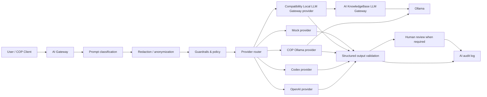

# 01 AI Architecture

AI vrstva je asistivní a nesmí být rozhodovacím jádrem COP systému. Pomáhá s vysvětlením situačního obrazu, shrnutím dat, konflikty zdrojů, návrhem dotazů, kontrolou kvality dat, dokumentací a orientací operátora v datech.

AI nesmí vybírat cíle, prioritizovat cíle pro zásah, doporučovat použití síly, plánovat útok, navádět prostředky ani poskytovat taktické bojové doporučení.

Externí AI provider musí být vypnutelný. Local-only režim musí být podporovaný pro prostředí, kde data nesmí opustit kontrolovanou infrastrukturu.

Produkční lokální režim COP používá primárně `ollama` provider, který běží
server-side v COP API a volá Ollama runtime přímo. Provider `local` přes AI
KnowledgeBase LLM Gateway zůstává kompatibilní fallback, ne primární cesta.
