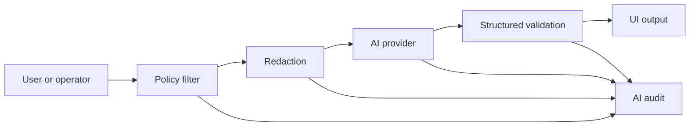

# 09 Assistive AI COP Roadmap

Tento dokument převádí principy vícezdrojové AI/COP analýzy do civilního CSM.
AI má pomáhat s orientací, kvalitou dat a vysvětlením. Nesmí autonomně
rozhodovat ani nahrazovat operátora nebo občana.

## Povolené Moduly

### Data Quality Assistant

- detekce stale dat,
- detekce konfliktu zdrojů,
- shrnutí confidence faktorů,
- upozornění na chybějící provenance,
- vysvětlení rozdílu mezi měřeným, modelovaným a syntetickým údajem.

### Situation Summary Assistant

- shrnutí aktivní mapové vrstvy,
- shrnutí vybrané události,
- zjednodušení odborného textu pro občana,
- překlad mezi češtinou a angličtinou,
- příprava situačního reportu pro operátora.

### Community Report Assistant

- pomoc s popisem hlášení,
- extrakce času, místa a typu rizika z uživatelského textu,
- návrh kategorií a tagů,
- detekce duplicity hlášení,
- sumarizace médií jen v rozsahu, ke kterému má uživatel oprávnění.

### Provider Diagnostics Assistant

- shrnutí stavu providerů,
- vysvětlení degraded/stale bez strašení občana,
- návrh technického postupu pro operátora nebo vývojáře.

## Zakázané Výstupy

AI nesmí:

- doporučit zásah nebo použití síly,
- určovat cíl,
- prioritizovat objekty jako cíle,
- navádět prostředky,
- plánovat útok nebo obranu,
- obcházet bezpečnostní kontroly,
- číst nebo shrnovat média mimo `releasePolicy` uživatele.

## Povinná Vysvětlitelnost

Každý AI výstup, který se objeví v produkčním UI, musí mít:

- účel dotazu,
- použitý rozsah dat,
- policy výsledek,
- informaci, zda šlo o měřená/modelovaná/syntetická data,
- odkaz na provenance zdrojových entit,
- audit ID.

Krátká občanská odpověď smí být jednoduchá, ale operátor musí mít možnost
otevřít detail “proč AI tvrdí toto”.

## Bezpečný Tok Dotazu

AI provider nikdy nedostane data, která uživatel nemá právo vidět v COP UI.

## Model Registry

Před produkčním použitím externího nebo lokálního modelu musí být evidováno:

- provider,
- model/version,
- účel použití,
- povolené datové třídy,
- retence dotazů,
- redakční pravidla,
- známá omezení,
- datum posledního bezpečnostního review.

## Implementační Priorita

1. Policy-filtered AI query context nad canonical entity modelem.
2. Audit a structured output validation.
3. Data quality assistant pro source conflict/stale/confidence.
4. Situation summary pro událost/workspace.
5. Community report assistant pro text a kategorie.
6. Až potom multimediální shrnutí, a jen s media ACL.
