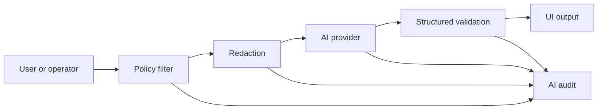

# 09 Assistive AI COP Roadmap

Tento dokument převádí principy vícezdrojové AI/COP analýzy do civilního CSM.
AI má pomáhat s orientací, kvalitou dat a vysvětlením. Nesmí autonomně
rozhodovat ani nahrazovat operátora nebo občana.

## Povolené Moduly

### Data Quality Assistant

- detekce stale dat,
- detekce konfliktu zdrojů,
- shrnutí confidence faktorů,
- upozornění na chybějící provenance,
- vysvětlení rozdílu mezi měřeným, modelovaným a syntetickým údajem.

### Situation Summary Assistant

- shrnutí aktivní mapové vrstvy,
- shrnutí vybrané události,
- zjednodušení odborného textu pro občana,
- překlad mezi češtinou a angličtinou,
- příprava situačního reportu pro operátora.

### Community Report Assistant

- pomoc s popisem hlášení,
- extrakce času, místa a typu rizika z uživatelského textu,
- návrh kategorií a tagů,
- detekce duplicity hlášení,
- sumarizace médií jen v rozsahu, ke kterému má uživatel oprávnění.

### Provider Diagnostics Assistant

- shrnutí stavu providerů,
- vysvětlení degraded/stale bez strašení občana,
- návrh technického postupu pro operátora nebo vývojáře.

## Zakázané Výstupy

AI nesmí:

- doporučit zásah nebo použití síly,
- určovat cíl,
- prioritizovat objekty jako cíle,
- navádět prostředky,
- plánovat útok nebo obranu,
- obcházet bezpečnostní kontroly,
- číst nebo shrnovat média mimo `releasePolicy` uživatele.

## Povinná Vysvětlitelnost

Každý AI výstup, který se objeví v produkčním UI, musí mít:

- účel dotazu,
- použitý rozsah dat,
- policy výsledek,
- informaci, zda šlo o měřená/modelovaná/syntetická data,
- odkaz na provenance zdrojových entit,
- audit ID.

Krátká občanská odpověď smí být jednoduchá, ale operátor musí mít možnost
otevřít detail “proč AI tvrdí toto”.

## Bezpečný Tok Dotazu

AI provider nikdy nedostane data, která uživatel nemá právo vidět v COP UI.

## Implementovaný Runtime Stav

COP má server-side AI runtime za `@cop/ai-gateway`:

- primární lokální provider `ollama` volaný pouze z `cop-api`,
- kompatibilní fallback `local` pro AI KnowledgeBase LLM Gateway,
- bezpečný vývojový `mock` provider,
- deterministický model router `deterministic-v1` pro volbu fast/reasoning
  Ollama profilu,
- server-side Ollama embedding provider a semantic context vrstva přes `bge-m3`
  pro retrieval/RAG nad policy-filtered COP daty,
- background `AiContextIndex` přes public/policy-safe canonical entity s geo
  filtrem, časovým oknem, citacemi `[I*]` a auditovanými read-only tool calls,
- guardrails před každým voláním modelu,
- audit pro každý AI request,
- health signal `ai-gateway` a `ai-context-index` v `/health/dependencies`.

Aktivní aplikační endpointy:

- `POST /api/v1/ai/cop-assistant/query` pro obecné povolené dotazy,
- `POST /api/v1/ai/situation-summary` pro situační souhrn z krizově
  prioritizovaných COP objektů, výstrah, komunitních hlášení, incidentů a
  provider health,
- `POST /api/v1/ai/chat-agent/query` pro explicitní otázku viditelnému AI agentovi v COP chatu,
- `POST /api/v1/ai/source-health-summary` pro vysvětlení kvality zdrojů,
- `POST /api/v1/ai/community-report/draft` pro pomoc s občanským hlášením.

COP Chat používá `POST /api/v1/ai/situation-summary` pro explicitní
uživatelský dialog “AI situační souhrn”. Dialog pracuje s policy-filtered COP
kontextem připraveným serverem, k requestu přidává poslední sdílenou polohu z
viditelné timeline jako `geoContext`, zobrazuje audit ID, citace použitých
zdrojů a nečte Matrix E2EE obsah místnosti na serveru.

COP Chat má také group-level metadata `chat.aiAssistant`. Správce skupiny může
AI agenta zapnout nebo vypnout z menu skupiny i v detailu skupiny, ale zapnutí
vyžaduje explicitní consent pro viditelného Matrix bot člena místnosti. COP po consentu synchronizuje
konfigurovaný systémový účet `COP AI Assistant` do CSM Messaging konverzace,
získá pro něj krátkodobý Matrix token přes server-side bootstrap a přijme pozvánku
do navázané E2EE místnosti. U soukromých E2EE místností pozvánku posílá
aktuální webový klient, který už je členem roomu; po pozvánce klient zopakuje
metadata update, aby backend mohl potvrdit bot join a obnovit stav. Metadata
`chat.aiAssistant.matrixBot` a `e2ee` ukazují stav členství a key model bez
zveřejnění tokenů.

Key model agenta je `dedicated_matrix_account_device` s politikou
`future_megolm_sessions_after_join`. Agent může pracovat s novými zprávami po
připojení a sdílení klíčů v místnosti; API samo nečte historickou šifrovanou
Matrix timeline a není plaintext proxy. Dotazy dál jdou přes
`POST /api/v1/ai/chat-agent/query`. Endpoint je autentizovaný, pro `groupId`
vyžaduje aktivní členství a skládá COP kontext server-side z aktuálních objektů,
výstrah, komunitních hlášení, incidentů a stavu zdrojů. Klient může k dotazu
přidat `chatContext` s omezeným výňatkem aktuálně viditelné/dešifrované Matrix
timeline.

Webový klient navíc nabízí samostatný direct chat s `COP AI Assistant`. V tomto
AI-only chatu je každá běžná zpráva dotazem na AI agenta. Slash příkazy
`/ai`, `/reasoning` a `/fast` fungují v AI chatu i ve skupinách se zapnutým
agentem; `/reasoning` předává do API `modelPreference=reasoning`. Composer
našeptává také `@COP AI` a `@AI`, a to jak ve skupinách se zapnutým agentem,
tak v metadata-light AI direct chatech rozpoznaných podle kanonického titulku
`COP AI Assistant`.

Odpovědi AI odeslané do Matrixu jsou běžné `m.room.message` události s
namespaced `cz.cop` metadaty. UI je díky tomu označí jako `COP AI agent` nebo
`AI situační souhrn` a ukáže request/audit/policy údaje bez parsování textu
zprávy. V zapnutých skupinách composer rozpozná také vedoucí zmínku
`@COP AI ...`; odpovědi se statusem `NEEDS_HUMAN_REVIEW` se neodesílají
automaticky a otevřou potvrzovací dialog.

AI odpovědi zároveň nesou `result.structured.evidence` s krátkými citacemi z
`priorityContext`, requestového `semanticContext` a background `indexedContext`.
COP Chat tento evidence blok zobrazuje v náhledu odpovědi a do Matrix `cz.cop`
metadat ukládá počty requestových a indexovaných zdrojů, aby timeline ukázala,
zda odpověď vznikla nad reálným COP kontextem.

AI endpointy mají tvrdé limity pro produkční použitelnost. Requestový semantic
retrieval pracuje jen s nejdůležitějšími kandidáty a po timeoutu degraduje na
prázdný semantic context; modelové volání má samostatný timeout a při překročení
vrací auditovaný `NEEDS_HUMAN_REVIEW` výsledek s vysvětlením místo visícího UI.

AI Gateway vrací volitelné `routing` metadata. Běžné dotazy používají fast profil
`gemma4:12b-mlx`; komplexní dotazy nad širším COP kontextem, konflikty zdrojů,
riziky, projekcí vývoje nebo delší chatovou timeline může router poslat na
reasoning profil `gemma4:31b-mlx`. `bge-m3` běží jako server-side embedding model
pro semantic context vrstvu. AI endpointy z už autorizovaných COP objektů,
výstrah, komunitních hlášení, incidentů, source health a consentovaného
chatContextu sestaví dokumenty, seřadí je podle podobnosti k dotazu a vloží do
LLM kontextu omezený `semanticContext`. Retrieval nikdy nerozšiřuje oprávnění:
RBAC/ABAC, release policy a E2EE consent se aplikují před tvorbou dokumentů.

`situation-summary` a `chat-agent/query` předávají LLM také serverový
`priorityContext`. Ten řadí signály podle krizové důležitosti před čistou
semantic podobností: voda/povodeň, požár, zdravotní riziko, infrastruktura,
doprava, bezpečnostní nebo policejní incidenty, komunitní hlášení a aktivní
výstrahy mají přednost před rutinní diagnostikou zdrojů. Zastaralé nebo
low-confidence civilní letecké tracky jsou nízká priorita, pokud přímo nesouvisí
s dotazem, bezpečností nebo datovým pokrytím. `semanticContext.citations` a
`priorityContext.citations` dávají modelu krátké citační značky (`[S1]`,
`[P1]`) pro důležitá tvrzení.

Stejné endpointy přidávají také `indexedContext`. Ten je načtený z
background COP indexu přes auditované tool volání `cop.ai.context_index.query`.
Index se obnovuje na pozadí z aktuálních objektů, systémových alertů,
veřejných/komunitních hlášení, incidentů a source health. Dotaz do indexu
používá explicitní `bbox`/current location z klienta, případně odhad místa z
textu přes geocoder, a výchozí sedmidenní časové okno. Citace z indexu mají
tvar `[I1]`. Index záměrně neobsahuje privátní community reporty ani server-side
Matrix E2EE historii; chatová paměť zůstává jen v consentovaném requestovém
`chatContext`.

Každý výstup z těchto endpointů vrací klientovi omezený evidence blok, který
spojuje priority `[P*]`, requestové semantic citace `[S*]`, background index
citace `[I*]`, stav retrievalu a mapové kandidáty. Tento blok je určený pro
transparentní UI a budoucí mapové snapshoty, ne jako náhrada COP oprávnění.

`priorityContext.mapSnapshot` zatím obsahuje strukturované kandidáty a bounding
box pro budoucí mapový náhled; není to serverem vyrenderovaný obrázek.

Tyto endpointy jsou určeny i pro iOS/iPadOS klienty. Klienti nemají znát Ollama
URL, LLM Gateway URL ani service tokeny.

## Model Registry

Před produkčním použitím externího nebo lokálního modelu musí být evidováno:

- provider,
- model/version,
- účel použití,
- povolené datové třídy,
- retence dotazů,
- redakční pravidla,
- známá omezení,
- datum posledního bezpečnostního review.

## Implementační Priorita

1. Policy-filtered AI query context nad canonical entity modelem. Stav: hotovo pro základní objekty, alerty a source health.
2. Audit a structured output validation. Stav: audit hotový, structured validation rozšířit pro specializované JSON odpovědi.
3. Data quality assistant pro source conflict/stale/confidence. Stav: základ přes source health summary, rozšířit o detail confidence faktorů.
4. Situation summary pro událost/workspace. Stav: základní endpoint hotový a
   první chat UI dialog napojený na server-side COP kontext.
5. Community report assistant pro text a kategorie. Stav: základní endpoint hotový bez čtení médií.
6. Viditelný chat AI agent. Stav: explicitní consent, Matrix bot účet jako
   systémový člen konverzace, přijetí invite do E2EE místnosti, key model
   `dedicated_matrix_account_device`, dotazovací dialog, `@COP AI` mention tok,
   Matrix `cz.cop` auditní metadata včetně počtů zdrojů a client-supplied `chatContext` nad
   viditelnou timeline jsou hotové bez server-side čtení historické E2EE
   historie. Composer ukazuje nápovědu pro `@COP AI`, `@AI`, `/ai`, `/fast`
   a `/reasoning`.
7. Až potom multimediální shrnutí, a jen s media ACL.
8. Semantický COP retrieval/RAG přes `bge-m3` nad canonical entity chunks. Stav:
   semantic context vrstva je hotová pro aktuální autorizovaný kontext a první
   background `AiContextIndex` je hotový pro public/policy-safe canonical entity
   s geo filtrem, časovým oknem, `[I*]` citacemi, health signálem a auditovanými
   read-only tool calls. API odpovědi vrací `result.structured.evidence` a chat
   UI ho zobrazuje jako citace zdrojů. Další krok je perzistence indexu mimo
   paměť procesu, širší konektory na weather/safety/mapové vrstvy, incremental
   refresh a mapové snapshoty jako obrazové/strukturované přílohy odpovědi.
