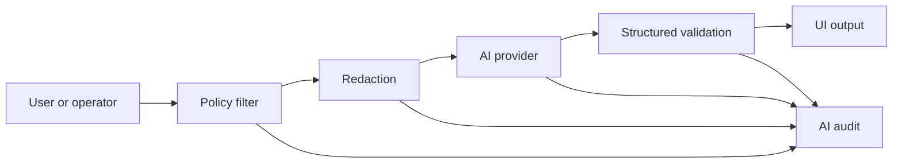

# 09 Assistive AI COP Roadmap

Tento dokument převádí principy vícezdrojové AI/COP analýzy do civilního CSM.
AI má pomáhat s orientací, kvalitou dat a vysvětlením. Nesmí autonomně
rozhodovat ani nahrazovat operátora nebo občana.

## Povolené Moduly

### Data Quality Assistant

- detekce stale dat,
- detekce konfliktu zdrojů,
- shrnutí confidence faktorů,
- upozornění na chybějící provenance,
- vysvětlení rozdílu mezi měřeným, modelovaným a syntetickým údajem.

### Situation Summary Assistant

- shrnutí aktivní mapové vrstvy,
- shrnutí vybrané události,
- zjednodušení odborného textu pro občana,
- překlad mezi češtinou a angličtinou,
- příprava situačního reportu pro operátora.

### Community Report Assistant

- pomoc s popisem hlášení,
- extrakce času, místa a typu rizika z uživatelského textu,
- návrh kategorií a tagů,
- detekce duplicity hlášení,
- sumarizace médií jen v rozsahu, ke kterému má uživatel oprávnění.

### Provider Diagnostics Assistant

- shrnutí stavu providerů,
- vysvětlení degraded/stale bez strašení občana,
- návrh technického postupu pro operátora nebo vývojáře.

## Zakázané Výstupy

AI nesmí:

- doporučit zásah nebo použití síly,
- určovat cíl,
- prioritizovat objekty jako cíle,
- navádět prostředky,
- plánovat útok nebo obranu,
- obcházet bezpečnostní kontroly,
- číst nebo shrnovat média mimo `releasePolicy` uživatele.

## Povinná Vysvětlitelnost

Každý AI výstup, který se objeví v produkčním UI, musí mít:

- účel dotazu,
- použitý rozsah dat,
- policy výsledek,
- informaci, zda šlo o měřená/modelovaná/syntetická data,
- odkaz na provenance zdrojových entit,
- audit ID.

Krátká občanská odpověď smí být jednoduchá, ale operátor musí mít možnost
otevřít detail “proč AI tvrdí toto”.

## Bezpečný Tok Dotazu

AI provider nikdy nedostane data, která uživatel nemá právo vidět v COP UI.

## Implementovaný Runtime Stav

COP má server-side AI runtime za `@cop/ai-gateway`:

- primární lokální provider `ollama` volaný pouze z `cop-api`,
- kompatibilní fallback `local` pro AI KnowledgeBase LLM Gateway,
- bezpečný vývojový `mock` provider,
- guardrails před každým voláním modelu,
- audit pro každý AI request,
- health signal `ai-gateway` v `/health/dependencies`.

Aktivní aplikační endpointy:

- `POST /api/v1/ai/cop-assistant/query` pro obecné povolené dotazy,
- `POST /api/v1/ai/situation-summary` pro situační souhrn z COP objektů, výstrah a provider health,
- `POST /api/v1/ai/chat-agent/query` pro explicitní otázku viditelnému AI agentovi v COP chatu,
- `POST /api/v1/ai/source-health-summary` pro vysvětlení kvality zdrojů,
- `POST /api/v1/ai/community-report/draft` pro pomoc s občanským hlášením.

COP Chat používá `POST /api/v1/ai/situation-summary` pro explicitní
uživatelský dialog “AI situační souhrn”. První verze pracuje jen s
policy-filtered COP kontextem připraveným serverem, zobrazuje audit ID a
nečte Matrix E2EE obsah místnosti.

COP Chat má také group-level metadata `chat.aiAssistant`. Správce skupiny může
AI agenta zapnout nebo vypnout v detailu skupiny. Zapnutý agent je v UI
viditelný jako samostatný řádek mezi členy a dotazy jdou přes
`POST /api/v1/ai/chat-agent/query`. Endpoint je autentizovaný, pro `groupId`
vyžaduje aktivní členství a skládá COP kontext server-side; nečte šifrovanou
Matrix historii.

Tyto endpointy jsou určeny i pro iOS/iPadOS klienty. Klienti nemají znát Ollama
URL, LLM Gateway URL ani service tokeny.

## Model Registry

Před produkčním použitím externího nebo lokálního modelu musí být evidováno:

- provider,
- model/version,
- účel použití,
- povolené datové třídy,
- retence dotazů,
- redakční pravidla,
- známá omezení,
- datum posledního bezpečnostního review.

## Implementační Priorita

1. Policy-filtered AI query context nad canonical entity modelem. Stav: hotovo pro základní objekty, alerty a source health.
2. Audit a structured output validation. Stav: audit hotový, structured validation rozšířit pro specializované JSON odpovědi.
3. Data quality assistant pro source conflict/stale/confidence. Stav: základ přes source health summary, rozšířit o detail confidence faktorů.
4. Situation summary pro událost/workspace. Stav: základní endpoint hotový a
   první chat UI dialog napojený na server-side COP kontext.
5. Community report assistant pro text a kategorie. Stav: základní endpoint hotový bez čtení médií.
6. Viditelný chat AI agent. Stav: group-level metadata a explicitní dotazovací
   dialog hotový bez čtení E2EE historie.
7. Až potom multimediální shrnutí, a jen s media ACL.
