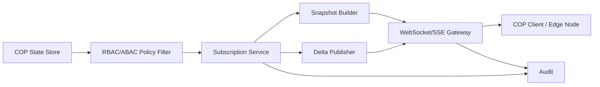

# 06 COP Distribution

COP distribuce poskytuje oprávněným klientům snapshot, delta updates a degraded/batch režimy.

Subscription je omezena oblastí zájmu, vrstvami, typy objektů, confidence thresholdem, syntetickým flagem a policy pravidly.
