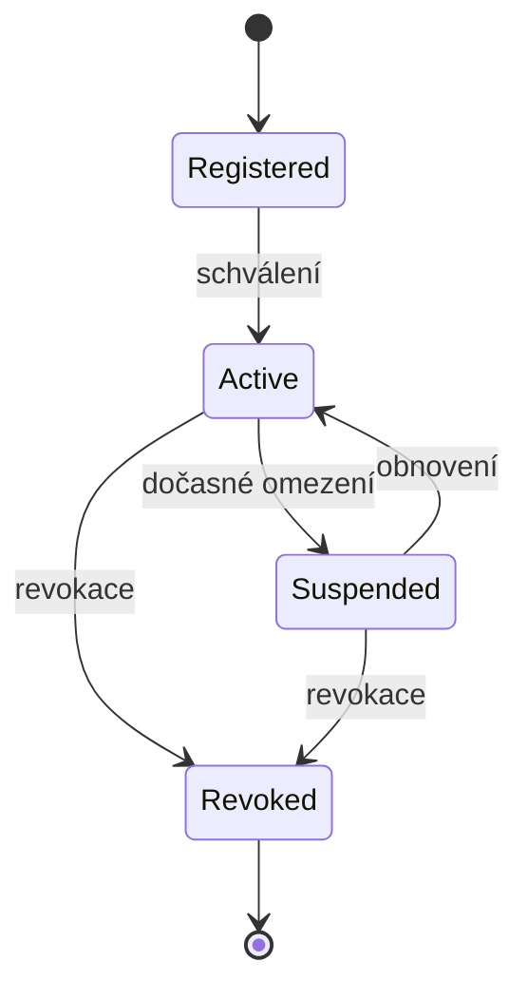

# 07 Source Registry

Source Registry eviduje zdroje dat, jejich oprávnění, trust profil, povolené event types, povolené object types a stav lifecycle.

Každá ingest událost musí projít kontrolou Source Registry. Revokovaný zdroj nemá právo publikovat nové události.
