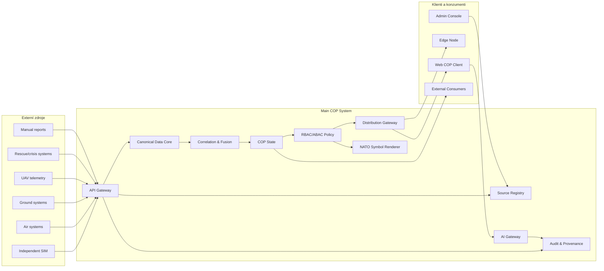

# 02 System Context

Hlavní COP systém stojí mezi externími zdroji situačních dat a oprávněnými klienty. Zdroje posílají události přes ingest API. COP systém je normalizuje, koreluje, ukládá a distribuuje jako policy-filtered COP.

SIM je v tomto pohledu pouze externí source system. Nesmí obcházet Source Registry ani validaci event envelope.
