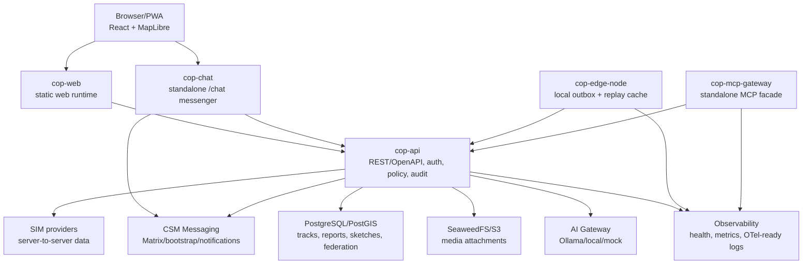

# 03 Container View

Aktuální pilotní fyzické služby v tomto repozitáři:

- `cop-web`: webový klient a PWA shell.
- `cop-chat`: samostatná chatovací aplikace publikovaná pod `/chat/`.
  Používá existující COP auth, messaging metadata endpointy a browser Matrix
  SDK; COP API pořád neproxyuje plaintext zprávy.
- `cop-api`: centrální rozhodovací backend, katalog vrstev, provider adaptéry,
  komunitní hlášení, média, sketch drawings, messaging bridge, policy a audit.
- `cop-edge-node`: samostatná edge služba s lokálním outboxem, replay cache a
  synchronizací do centrálního COP API.
- `cop-mcp-gateway`: samostatná MCP gateway pro externí agenty. Gateway
  neobsahuje vlastní business logiku; server-side volá auditované a
  allowlistované nástroje v `cop-api`.

Záměrně oddělené služby mimo tento repozitář:

- SIM poskytuje data pouze server-to-server.
- CSM Messaging řeší Matrix, zařízení a push doručení.
- SeaweedFS/S3 drží binární média.

Logické moduly jako fusion, policy, AI a observability zatím běží primárně v
`cop-api`; při růstu zátěže se mohou dále vyčlenit bez změny veřejného kontraktu.
