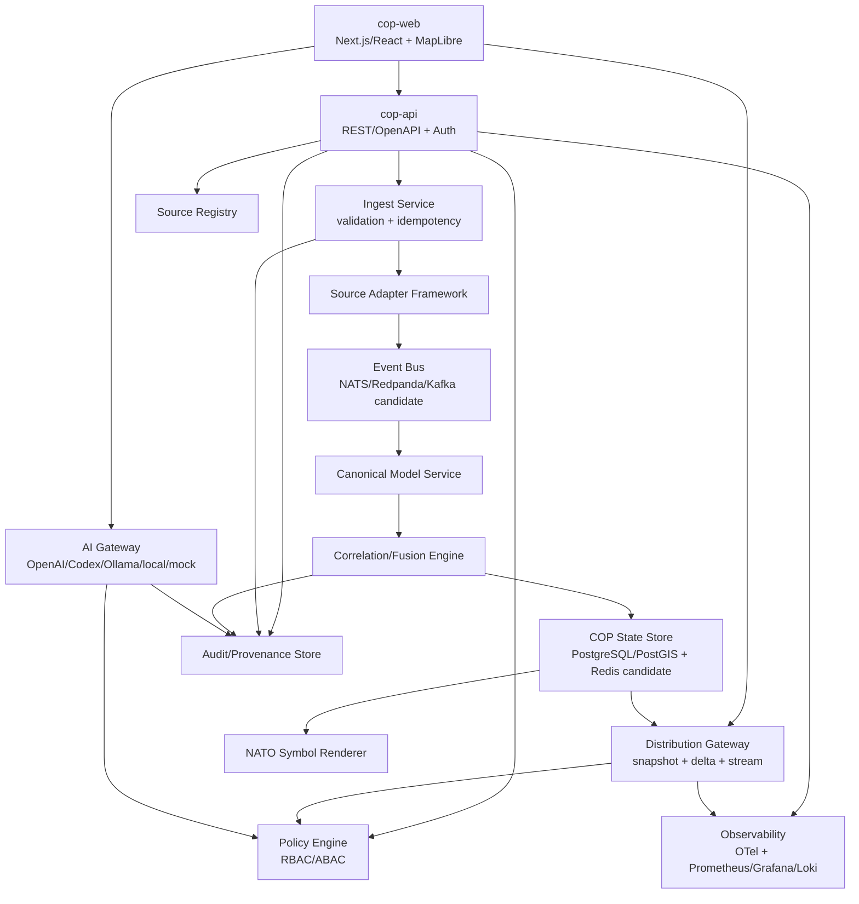

# 03 Container View

```mermaid
flowchart TB
    WEB["cop-web\nNext.js/React + MapLibre"]
    API["cop-api\nREST/OpenAPI + Auth"]
    INGEST["Ingest Service\nvalidation + idempotency"]
    ADAPTERS["Source Adapter Framework"]
    BUS["Event Bus\nNATS/Redpanda/Kafka candidate"]
    MODEL["Canonical Model Service"]
    FUSION["Correlation/Fusion Engine"]
    STATE["COP State Store\nPostgreSQL/PostGIS + Redis candidate"]
    DIST["Distribution Gateway\nsnapshot + delta + stream"]
    SYMBOL["NATO Symbol Renderer"]
    AI["AI Gateway\nOpenAI/Codex/Ollama/local/mock"]
    POLICY["Policy Engine\nRBAC/ABAC"]
    AUDIT["Audit/Provenance Store"]
    REG["Source Registry"]
    OBS["Observability\nOTel + Prometheus/Grafana/Loki"]

    WEB --> API
    WEB --> DIST
    WEB --> AI
    API --> INGEST
    API --> REG
    API --> POLICY
    INGEST --> ADAPTERS
    ADAPTERS --> BUS
    BUS --> MODEL
    MODEL --> FUSION
    FUSION --> STATE
    STATE --> DIST
    STATE --> SYMBOL
    DIST --> POLICY
    AI --> POLICY
    API --> AUDIT
    INGEST --> AUDIT
    FUSION --> AUDIT
    AI --> AUDIT
    API --> OBS
    DIST --> OBS
```

Kontejnery jsou logické. Fyzické balení bude rozhodnuto v navazujícím monorepo skeletonu.
