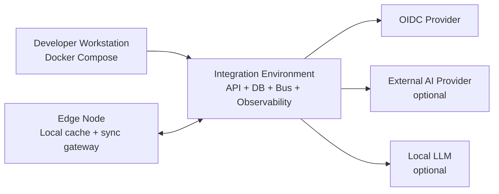

# 05 Deployment View

Baseline počítá se třemi cílovými režimy nasazení:

- lokální vývoj přes Docker Compose,
- integrační/testovací prostředí v on-prem nebo cloud infrastruktuře,
- edge/degraded režim s lokální cache a omezenou konektivitou.

Externí AI provider musí být vypnutelný. Edge režim nesmí obcházet policy enforcement ani auditní požadavky.
