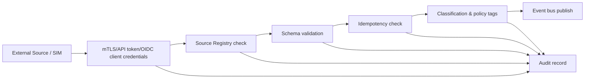

# 06 Integration Architecture

Integrace jsou vedené přes explicitní kontrakty. Každý zdroj je registrovaný v Source Registry a každá událost nese `sourceSystemId`, `adapterVersion`, `eventId`, `correlationId`, `producerTimestamp`, klasifikaci, informaci o syntetických datech a kvalitu.

SIM projekt se integruje jako `sourceType=SIMULATOR` a používá Shared Integration Contract v1.
