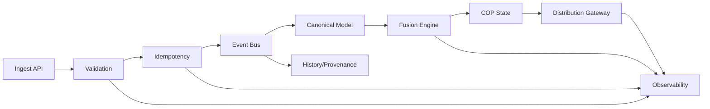

# 08 Event Driven Architecture

Událost je základní jednotka změny. Pipeline musí podporovat validaci, idempotency, ordering metadata, replay, backpressure a audit.

Event stream je interní mechanismus. Externí integrace používají publikovaná API a stream kontrakt.
