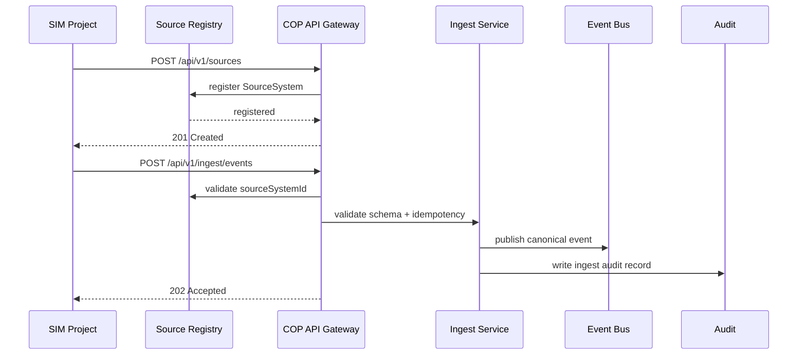

# 02 Simulator to COP Contract

SIM projekt je samostatně vyvíjený producent syntetických dat. V COP vystupuje jako registrovaný `SourceSystem` s `sourceType=SIMULATOR` a `synthetic=true`.

SIM posílá canonical event envelope, nikoli interní COP state nebo symboly. COP odpovídá za validaci, fusion a distribuci.

## Kontextové vrstvy SIM

Vedle ingestu tracků může COP číst kontextové vrstvy připravené SIM projektem:

- `GET https://sim.zeleznalady.cz/situation-data/api/v1/layers`,
- `GET https://sim.zeleznalady.cz/situation-data/api/v1/cop/features?bbox=west,south,east,north&layers=weather,ground,mobile,traffic&limit=250`.

Kontrakt je `cop-situation-source-v1` a vrací GeoJSON `FeatureCollection` s normalizovanými properties (`featureId`, `layer`, `label`, `category`, `sourceId`, `observedAt`, `confidence`, `stale`, `license`, `metrics`, `tags`).

COP pravidla:

- situation-data je `SourceSystem` typu `PUBLIC_SITUATION_AGGREGATE`,
- data jsou pouze mapový kontext, ne `ObservedObject`, ne temporal track history,
- výchozí vrstva je `weather`, ostatní vrstvy jsou volitelné v uživatelském profilu pohledu,
- dotaz se omezuje aktuálním bbox mapy a cachuje se na krátké okno,
- COP API nepřeposílá bearer token operátora do SIM,
- výpadek SIM vrací prázdnou degraded feature collection místo pádu mapy.
