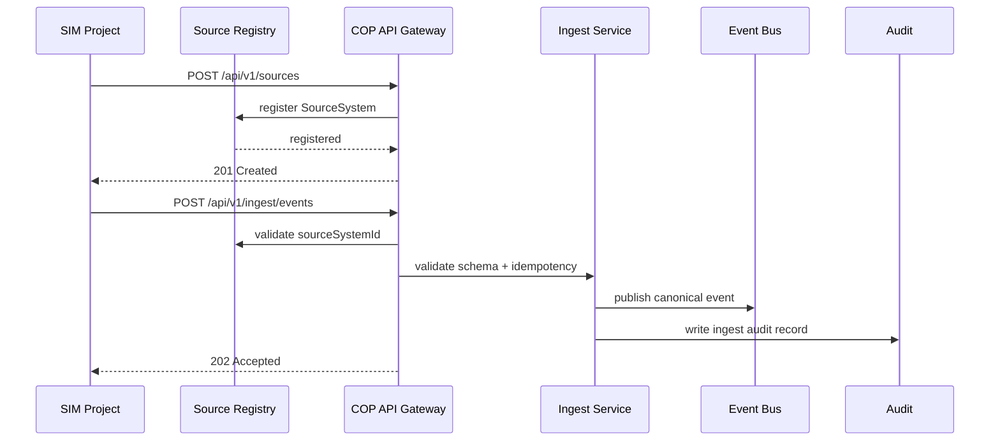

# 02 Simulator to COP Contract

SIM projekt je samostatně vyvíjený producent syntetických dat. V COP vystupuje jako registrovaný `SourceSystem` s `sourceType=SIMULATOR` a `synthetic=true`.

SIM posílá canonical event envelope, nikoli interní COP state nebo symboly. COP odpovídá za validaci, fusion a distribuci.
