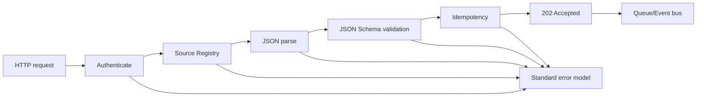

# 03 Ingest API Contract

Ingest API přijímá single event nebo batch. Všechny payloady používají `canonical-event-envelope.schema.json`.

## Endpointy

- `POST /api/v1/ingest/events`
- `POST /api/v1/ingest/batches`

Batch request musí obsahovat `batchId`, `contractVersion`, `sourceSystemId` a pole `events`.
