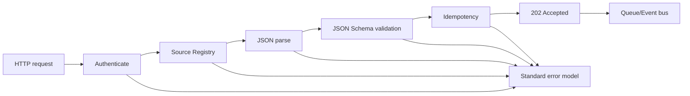

# 03 Ingest API Contract

Ingest API přijímá single event nebo batch. Všechny payloady používají `canonical-event-envelope.schema.json`.


```mermaid
flowchart LR
    REQ["HTTP request"]
    AUTH["Authenticate"]
    SRC["Source Registry"]
    JSON["JSON parse"]
    SCHEMA["JSON Schema validation"]
    IDEMP["Idempotency"]
    ACCEPT["202 Accepted"]
    QUEUE["Queue/Event bus"]
    ERROR["Standard error model"]

    REQ --> AUTH --> SRC --> JSON --> SCHEMA --> IDEMP --> ACCEPT --> QUEUE
    AUTH --> ERROR
    SRC --> ERROR
    JSON --> ERROR
    SCHEMA --> ERROR
    IDEMP --> ERROR
```

## Endpointy

- `POST /api/v1/ingest/events`
- `POST /api/v1/ingest/batches`

Batch request musí obsahovat `batchId`, `contractVersion`, `sourceSystemId` a pole `events`.

## Oprávnění a publikace kanonického feedu

Autentizace probíhá před parsováním těla. Samotná přihlášená občanská relace
neopravňuje k publikaci pod libovolným registrovaným zdrojem. Ingest vyžaduje
platný povolený službový lab token nebo OIDC roli `COP_OPERATOR`,
`INTEGRATION_ADMIN` či `SYSTEM_CLIENT`; jinak vrací `403 INGEST_FORBIDDEN`.
OIDC identita musí mít neprázdné `sub`. Hlavička zdroje nenahrazuje oprávnění.

Současný kanonický feed přijímá pouze `UNCLASSIFIED`, v rámci limitu zdroje.
Jiná třída vrací `422 CLASSIFICATION_NOT_ALLOWED`. Explicitní `releasePolicy`
musí být veřejná, obsahovat scope `public`, nemít cílená omezení uživatelů,
skupin nebo událostí ani neveřejná média a nesmí být expirovaná. Jinak vrací
`422 RELEASE_POLICY_NOT_ALLOWED`. Dosavadní kompatibilní absence této policy
je přípustná pouze s ověřenou třídou. Soukromé komunitní zprávy a Dispatch
nadále používají vlastní oddělené kontrakty.

U dávky se všechny položky zkontrolují proti zdroji, typům událostí/objektů,
syntetickému režimu a publikační hranici před zápisem první položky.
Klasifikace je uchována v serverem vytvořené provenienci. Čtení, stream,
historie i odvozená konfliktní evidence znovu kontrolují publikační oprávnění.
Starší uložené body bez ověřitelné původní klasifikace se automaticky
neoznačují jako veřejné: zůstávají uložené, ale nepublikované do přijetí nové
ověřené zdrojové události. Jde o bezpečné čtení, nikoli mazání historie.

Podrobnosti: [ADR 0039](../adr/0039_CANONICAL_PUBLICATION_BOUNDARY.md).

## Čas přijetí vlastní COP

Při prvním externím přijetí přes oba ingest endpointy určí `ingestTimestamp`
hodiny serveru COP. Klientská hodnota tohoto pole se nepoužije jako čas přijetí
ani při porovnání identity události. `producerTimestamp`, poloha a ostatní
kanonické údaje producenta zůstávají zachované; `producerTimestamp` proto není
důkazem času přijetí serverem. `receivedAt` v single-event odpovědi odpovídá
původnímu serverovému `ingestTimestamp`, který se při identickém opakování nemění.

## Neměnné eventId a opakování požadavků

Identitu události tvoří celý `CanonicalEventEnvelope` kromě `ingestTimestamp`.
Zahrnuje tedy také klasifikaci, zdroj, `correlationId` uvnitř těla,
`producerTimestamp`, polohu a payload. Pro změnu události vytvořte nové UUID
`eventId`; při opakování zachovejte původní tělo. Po úspěšné kontrole schématu,
zdroje a publikační policy vrátí opakované `eventId` s jiným kanonickým obsahem
`409 EVENT_ID_CONFLICT`. Již nepovolený vstup, například třída `SECRET`, je
zamítnut dřívější kontrolou jako `422 CLASSIFICATION_NOT_ALLOWED`.

Identické opakování `eventId` vrací `202` a zachová původní čas přijetí. Nevytvoří
další bod historie ani opakovaný zápis události/tracku nebo publikaci tracku.
Single endpoint nadále vyžaduje `X-Idempotency-Key`: stejný klíč a nezměněné tělo
po vynechání `ingestTimestamp` vrací původní acknowledgement; jiný obsah pod
stejným klíčem vrací `409 IDEMPOTENCY_CONFLICT`, pokud požadavek nezamítne již
dřívější kontrola. Stejná událost pod novým request klíčem také nevytvoří další
historický bod. Nemění se dosavadní způsob výpočtu request-key hashe; klient má
při retry zachovat také serializaci těla.

Index událostí a evidence request klíčů jsou v RAM konkrétní instance COP.
Nejde o trvalou globální deduplikaci přes restart nebo mezi více instancemi;
durable event-ID index a migrace nejsou součástí této změny.

## Dávky: kontrola hranice a kompatibilní dílčí acknowledgement

U všech schema-validních položek se před první mutací ověří zdroj, publikační
policy a neměnnost `eventId`, a to i vůči dřívější položce stejné dávky. Chyba
této hranice odmítne celý požadavek bez přijetí jiných položek. Již přijatá ani
dříve uvedená událost nesmí být pod stejným ID přepsána jiným obsahem.

Zachované legacy chování schema-nevalidní položky je odlišné: tato položka je
v odpovědi `202` označena jako `REJECTED`, `errorCode: VALIDATION_ERROR` a
`eventId: "unknown"`; platné položky se mohou přijmout. Dávka proto neposkytuje
obecnou transakci všech položek při chybě schématu. `X-Idempotency-Key` je pro
batch pouze volitelná kompatibilní hlavička; endpoint neukládá acknowledgement
pod request klíčem. Deduplikace jednotlivých `eventId` nadále platí.

`acceptedCount` počítá položky potvrzené jako `QUEUED`, včetně identických
duplicit. Tyto duplicity však nevytvoří další historii, zápis ani publikaci.
`rejectedCount` počítá schema-nevalidní položky. UUID platné položky a přesná
hodnota `"unknown"` zamítnuté položky jsou obě popsány v OpenAPI.

Příklad acknowledgement pro jednu platnou a jednu schema-nevalidní položku:

```json
{
  "batchId": "66666666-6666-4666-8666-666666666666",
  "acceptedCount": 1,
  "rejectedCount": 1,
  "items": [
    { "eventId": "11111111-1111-4111-8111-111111111111", "status": "QUEUED" },
    { "eventId": "unknown", "status": "REJECTED", "errorCode": "VALIDATION_ERROR" }
  ]
}
```

## Chyby této hranice

Všechny uvedené chyby používají dosavadní COP envelope s `error.correlationId`.

| HTTP | Kód | Význam |
| --- | --- | --- |
| 400 | `VALIDATION_ERROR` | Neplatné single tělo nebo struktura dávky. Schema-nevalidní položka platné dávky má kompatibilní dílčí acknowledgement výše. |
| 400 | `IDEMPOTENCY_KEY_REQUIRED` | Single endpoint nemá `X-Idempotency-Key`. |
| 403 | `INGEST_FORBIDDEN` | Přihlášená identita nemá oprávnění kanonického ingestu. |
| 409 | `EVENT_ID_CONFLICT` | Jiný kanonický obsah pod existujícím `eventId` po úspěšné kontrole schématu, zdroje a policy. |
| 409 | `IDEMPOTENCY_CONFLICT` | Single request klíč již označuje jiný obsah. |
| 422 | `CLASSIFICATION_NOT_ALLOWED` / `RELEASE_POLICY_NOT_ALLOWED` | Obsah nesplňuje aktuální publikační hranici. |
