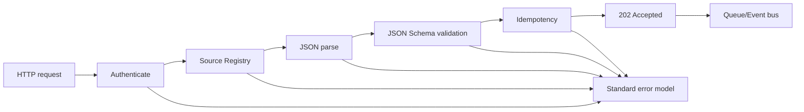

# 03 Ingest API Contract

Ingest API přijímá single event nebo batch. Všechny payloady používají `canonical-event-envelope.schema.json`.

```mermaid
flowchart LR
    REQ["HTTP request"]
    AUTH["Authenticate"]
    SRC["Source Registry"]
    JSON["JSON parse"]
    SCHEMA["JSON Schema validation"]
    IDEMP["Idempotency"]
    ACCEPT["202 Accepted"]
    QUEUE["Queue/Event bus"]
    ERROR["Standard error model"]

    REQ --> AUTH --> SRC --> JSON --> SCHEMA --> IDEMP --> ACCEPT --> QUEUE
    AUTH --> ERROR
    SRC --> ERROR
    JSON --> ERROR
    SCHEMA --> ERROR
    IDEMP --> ERROR
```

## Endpointy

- `POST /api/v1/ingest/events`
- `POST /api/v1/ingest/batches`

Batch request musí obsahovat `batchId`, `contractVersion`, `sourceSystemId` a pole `events`.

## Oprávnění a publikace kanonického feedu

Autentizace probíhá před parsováním těla. Samotná přihlášená občanská relace
neopravňuje k publikaci pod libovolným registrovaným zdrojem. Ingest vyžaduje
platný povolený službový lab token nebo OIDC roli `COP_OPERATOR`,
`INTEGRATION_ADMIN` či `SYSTEM_CLIENT`; jinak vrací `403 INGEST_FORBIDDEN`.
OIDC identita musí mít neprázdné `sub`. Hlavička zdroje nenahrazuje oprávnění.

Současný kanonický feed přijímá pouze `UNCLASSIFIED`, v rámci limitu zdroje.
Jiná třída vrací `422 CLASSIFICATION_NOT_ALLOWED`. Explicitní `releasePolicy`
musí být veřejná, obsahovat scope `public`, nemít cílená omezení uživatelů,
skupin nebo událostí ani neveřejná média a nesmí být expirovaná. Jinak vrací
`422 RELEASE_POLICY_NOT_ALLOWED`. Dosavadní kompatibilní absence této policy
je přípustná pouze s ověřenou třídou. Soukromé komunitní zprávy a Dispatch
nadále používají vlastní oddělené kontrakty.

U dávky se všechny položky zkontrolují proti zdroji, typům událostí/objektů,
syntetickému režimu a publikační hranici před zápisem první položky.
Klasifikace je uchována v serverem vytvořené provenienci. Čtení, stream,
historie i odvozená konfliktní evidence znovu kontrolují publikační oprávnění.
Starší uložené body bez ověřitelné původní klasifikace se automaticky
neoznačují jako veřejné: zůstávají uložené, ale nepublikované do přijetí nové
ověřené zdrojové události. Jde o bezpečné čtení, nikoli mazání historie.

Podrobnosti: [ADR 0039](../adr/0039_CANONICAL_PUBLICATION_BOUNDARY.md).
