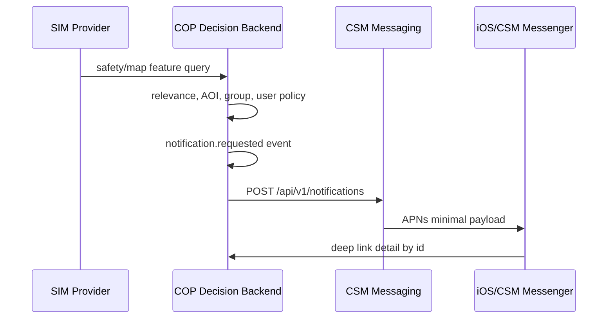

# 13 Event Contract and AsyncAPI Direction

COP používá REST/OpenAPI pro dotazy a příkazy, ale změny v systému musí být
modelované jako auditovatelné eventy. Tento dokument určuje hranici mezi REST,
event streamem, geodaty a AI/MCP vrstvou.

## Princip

Eventy jsou jednotný jazyk změn. Používají se pro:

- audit,
- replay,
- synchronizaci web/iOS/offline klientů,
- notifikační rozhodování,
- datovou lineage,
- zdrojovou observabilitu,
- budoucí federované uzly.

REST endpointy zůstávají autoritativní pro okamžité command/query operace.
Eventy z nich vznikají jako vedlejší auditovatelný výsledek.

## Hranice Kontraktů

| Vrstva | Použití | Kontrakt |
| --- | --- | --- |
| REST API | command/query, bootstrap, CRUD | `openapi/openapi.json` |
| SSE/WebSocket | live snapshot/delta pro klienty | `docs/integration/04_STREAMING_CONTRACT.md` |
| Domain events | audit, replay, notification decisions | tento dokument, budoucí `asyncapi/asyncapi.json` |
| Geodata | mapové features, rastry, grids | map catalog + GeoJSON/raster contracts |
| MCP/AI | AI assistant a tool orchestrace | AI policy, ne provider backbone |

## Doporučený Event Envelope

Každý domain event má minimálně:

```json
{
  "eventId": "uuid",
  "eventType": "community.report.created",
  "contractVersion": "cop-domain-event-v1",
  "source": {
    "sourceSystemId": "cop-api",
    "adapterId": "community-routes",
    "adapterVersion": "1"
  },
  "correlationId": "uuid",
  "producerTimestamp": "2026-06-19T12:00:00Z",
  "classification": {
    "level": "UNCLASSIFIED",
    "releasability": ["CIVIL"],
    "handlingCaveats": []
  },
  "releasePolicy": {
    "visibility": "group",
    "allowedScopes": ["group"],
    "groupIds": ["grp_..."]
  },
  "payload": {},
  "quality": {
    "confidence": 0.82,
    "dataQuality": "observed"
  },
  "provenance": []
}
```

TypeScript baseline je v `packages/canonical-model`.

## Povolené Event Typy

První sada eventů:

- `track.created`, `track.updated`, `track.lost`, `track.restored`,
  `track.deleted`
- `incident.created`, `incident.updated`, `incident.closed`
- `report.created`, `report.updated`, `report.submitted`
- `media.attached`, `media.derivative.created`
- `community.group.created`, `community.group.updated`,
  `community.group.member.updated`
- `alert.created`, `alert.updated`, `alert.acknowledged`
- `user.zone.created`, `user.zone.updated`, `user.zone.deleted`
- `zone.entered`, `zone.exited`
- `sketch.drawing.created`, `sketch.drawing.updated`,
  `sketch.drawing.deleted`
- `notification.requested`
- `ai.summary.created`
- `data.conflict.detected`
- `source.status.changed`

## Notification Decision Flow

Bezpečnostní a komunitní notifikace vznikají takto:



COP nikdy neposílá push přímo do APNs a nedrží APNs tokeny.

## AsyncAPI Roadmap

Další technický krok je doplnit `asyncapi/asyncapi.json` s kanály:

- `cop.domain.events`
- `cop.audit.events`
- `cop.notifications.requested`
- `cop.provider.health`
- `cop.ai.audit`

První verze může být dokumentační kontrakt bez produkčního brokeru. Jakmile se
zvolí event bus, ADR-0005 se doplní o konkrétní technologii, retenci, replay a
access model.

## Co Nesmí Dělat Event Stream

- Nenahrazuje OpenAPI command/query API.
- Nepřenáší plaintext chat zprávy.
- Neposílá syrové provider service tokeny.
- Neposílá chráněná média, pouze odkazy na autorizované COP zdroje.
- Neposkytuje žádné targeting, navádění ani weapon workflow.
