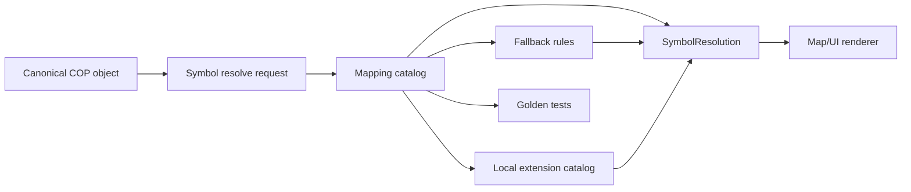

# 02 APP6 STANAG2019 Symbol Rendering

NATO Symbol Renderer je součást hlavního COP systému. Jeho účelem je převést canonical COP objekty na prezentační symboly pro webový, mobilní a edge klient. Externí zdroje, včetně SIM projektu, neposílají finální symbol code.

První fáze necílí na certifikovanou NATO shodu. Cílem je architektonická připravenost, katalog, mapping matrix, testovatelnost a jasné oddělení datového významu od prezentace.

## Vstup

Renderer přijímá canonical object nebo explicitní symbol resolve request:

- `objectType`,
- `affiliation`,
- `domain`,
- `status`,
- `modifiers`, například `confidence`, `synthetic`, `echelon`.

## Symbol resolver

Resolver mapuje kombinaci:

```text
objectType + affiliation + domain + status + modifiers -> SymbolResolution
```

Výstup:

```json
{
  "symbolSet": "APP6",
  "standardVersion": "APP-6/STANAG-2019-compatible-mapping",
  "symbolCode": "string",
  "renderer": "SVG",
  "modifiers": {
    "affiliation": "FRIEND",
    "domain": "AIR",
    "status": "ACTIVE",
    "confidence": 0.92
  },
  "fallback": false,
  "extension": null
}
```

## Rendering flow



## Fallback pravidla

- Nepokrytý `objectType` se mapuje na doménový generic symbol.
- Neznámá affiliation se mapuje jako `UNKNOWN` nebo `PENDING` podle policy.
- Neznámý modifier nesmí změnit datový význam objektu.
- Fallback musí být viditelný v `fallback=true` a auditovatelný.

## Lokální rozšíření

Lokální symbolická rozšíření musí být verzovaná, explicitně označená v `extension` a oddělená od standardního mapping katalogu. Rozšíření nesmí měnit canonical objekt, pouze prezentační metadata.

## Testovací přístup

- unit testy mapping katalogu,
- golden snapshots symbol response,
- contract testy endpointu `/api/v1/symbology/resolve`,
- vizuální regression testy klienta,
- testy fallbacku a lokálních rozšíření.
