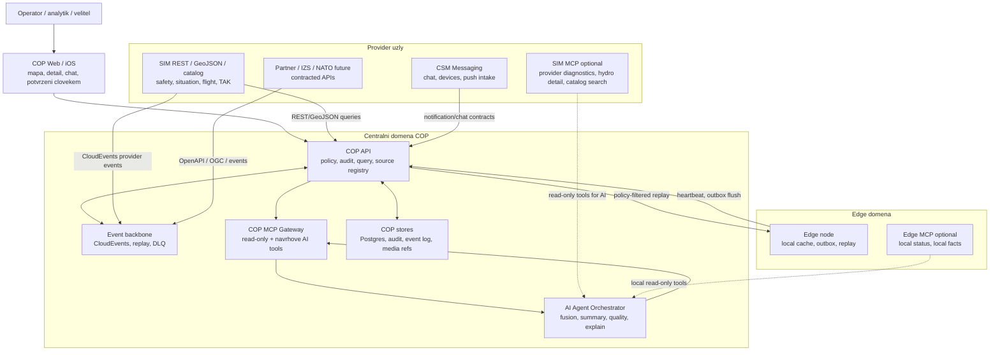

# 10 AI-COP Federation Gap Closure Assignment

## Ucel

Tento dokument je realizacni zadani pro doleceni hlavnich mezer mezi stavajicim
CSM/COP pilotem a cilovou vicevrstvou AI-COP/NIPS architekturou. Navazuje na
`docs/product/07_AI_COP_NIPS_TARGET_ROADMAP.md` a rozpracovava tri oblasti:

- federovanou architekturu uzlu, eventu a MCP,
- skutecnou analytickou vrstvu nad daty,
- bezpecnostni vrstvu pro need-to-know, audit a oddelene domeny.

Zadani nesmi vest k targetingu, navadeni, weapon workflow, autonomnimu
operacnimu rozhodovani ani doporucovani pouziti sily.

## Kratka Odpoved Na MCP

Predstava "N MCP serveru/agentu, kteri spolu komunikuji" je blizko, ale je
nutne ji zpresnit:

1. Uzly spolu primarne nekomunikuji pres MCP. Primarni systemova komunikace je
   pres REST/OpenAPI, GeoJSON/OGC API Features a CloudEvents/event broker.
2. MCP je agentni a dotazovaci vrstva. Slouzi k tomu, aby AI asistent mohl
   bezpecne volat allowlistovane nastroje daneho uzlu, ne aby nahradil datovou
   integraci.
3. Kazdy vyznamny uzel muze mit vlastni MCP server, ale nemusi. Povinne je MCP
   pro centralni COP. Pro SIM a edge je MCP vhodne jako read-only diagnosticka a
   analyticka brana.
4. Agenti nesmi vytvaret neregulovanou peer-to-peer sit. Agent orchestrace ma
   byt server-side, auditovana, policy-filtered a s lidskym potvrzenim u vseho,
   co meni stav.

Spravny mentalni model:

- "eventy" prenaseji zmeny stavu,
- "REST/GeoJSON" vraci kontraktovana data,
- "MCP" dava AI agentovi bezpecne nastroje pro dotazy a vysvetleni,
- "COP" zustava prezentacni, auditni a policy rozhodovaci vrstva,
- "SIM" zustava provider dat a simulaci, ne verejny frontend.

## Jednoduchy Obrazek Architektury



Nejdulezitejsi rozliseni: SIM muze mit MCP server, ale COP nema cist bezna
provider data pres MCP. Bezna data tecou pres provider kontrakty a eventy. MCP
se pouzije, kdyz se AI agent pta na vysvetleni, detail, diagnostiku nebo
policy-filtered souhrn.

## Cilovy Stav

CSM/COP ma byt federovana civilni situační schopnost, ve ktere:

- centralni COP drzi audit, policy, prezentacni query model a koordinaci,
- datovi provideri vlastni sve zdroje a publikuji data kontraktovanym zpusobem,
- edge uzly umi pracovat pri vypadku spojeni a synchronizovat udalosti zpet,
- AI agenti pracuji pouze pres allowlistovane nastroje a nemeni stav bez
  explicitniho potvrzeni clovekem,
- kazda entita a udalost nese klasifikaci, release policy, confidence,
  provenance a correlationId,
- operator vidi nejen vysledek, ale i zdroje, nejistotu a duvod doporuceneho
  vysvetleni nebo navrhu.

## Rozsah Dodavky

## Stav K 2026-06-25

Tento dokument je gap-closure zadani, ne potvrzeni, ze vsechny nize uvedene
faze jsou hotove. Aktualni produkcni checkpoint:

- Faze 0 je v COP uzavrena: `public.weather.webcams` se dotazuje jako
  `weather_webcams`, hydrologicke hodnoty se neorezavaji do rozsahu `0..1` a
  mapove safety/situation vrstvy se pri oddaleni na celou CR neskryvaji jen
  kvuli zoomu.
- COP ma pilotni federation runtime, event replay/DLQ, edge outbox/replay,
  standalone COP MCP gateway a deterministic fusion zaklad.
- Faze 1 az 5 zustavaji produkcni gap-closure prace: zejmena broker adapter,
  SIM/edge MCP topologie, sirsi analyticke moduly, finalni RBAC/ABAC matice,
  security test pack a scenarova akceptace.
- SIM se v beznem provozu dal cte pres REST/GeoJSON/katalog endpointy. MCP se
  nesmi pouzit jako nahrada mapove ani safety-data integrace.

### Proud A: Federace A Event Backbone

Implementovat produkcnejsi federacni runtime nad stavajicim zakladem.

Povinne pozadavky:

- rozsirit node registry o `nodeTrustDomain`, `mcpEndpoint`, `dataEndpoints`,
  `eventSubscriptions`, `publicKeyRef`, `classificationMax`, `releaseScopes`,
  `capabilities` a `softwareVersion`,
- zachovat stavajici REST endpointy pro heartbeat, replay, DLQ a edge outbox,
- doplnit broker adapter pod stejny kontrakt; pilotne lze pouzit NATS JetStream,
  Kafka-compatible broker nebo abstrakci s Postgres fallbackem,
- publikovat udalosti jako CloudEvents 1.0 s COP payloadem,
- zajistit idempotenci podle `id` / `eventId` / `clientEventId`,
- podporovat replay podle offsetu, casu, typu udalosti, entity a ciloveho uzlu,
- vest DLQ pro nevalidni, neautorizovane nebo nezname producer eventy,
- auditovat prijeti, odmitnuti, replay, redrive, resolve a edge cursor ack.

Minimalni eventy pro PoC:

- `sensor.observation.created`,
- `alert.raised`,
- `incident.created`,
- `incident.updated`,
- `report.created`,
- `sketch.drawing.created`,
- `notification.requested`,
- `node.disconnected`,
- `node.reconnected`,
- `ai.summary.generated`,
- `ai.tool.invoked`,
- `fusion.suggestion.created`,
- `fusion.suggestion.reviewed`.

Akceptace:

- registrovany SIM provider publikuje event do COP,
- COP event ulozi, audituje a vystavi v replay,
- edge uzel po vypadku posle outbox a stahne policy-filtered replay,
- nevalidni event skonci v DLQ s korelaci a lze ho redrive/resolve,
- stejny event znovu neprida duplicitu.

### Proud B: MCP Topologie A Agentni Vrstva

Rozsirit MCP z diagnostiky na skutecnou, ale porad bezpecnou agentni vrstvu.

Povinne principy:

- MCP neni integrační backbone; je to AI/tool rozhrani,
- kazdy tool je allowlistovany, verzovany, auditovany a policy-filtered,
- tool nesmi vracet provider tokeny, raw chat plaintext, tajne binarni prilohy
  ani data mimo opravneni volajiciho,
- state-changing tool smi vratit pouze navrh; zmena se provede az explicitnim
  COP command API s potvrzenim cloveka.

Minimalni MCP servery:

| Server | Povinnost | Ucel |
| --- | --- | --- |
| COP MCP Gateway | povinny | jednotny vstup pro AI asistenta, audit, policy, federacni tools |
| SIM MCP Gateway | doporuceny | read-only provider diagnostika, katalog, hydro detail, dostupnost zdroju |
| Edge MCP Gateway | doporuceny | lokalni stav edge, outbox, replay cache, lokalni facts pri offline |
| Messaging MCP Gateway | volitelny | read-only stav konverzaci, delivery status, bez plaintext obsahu |

Minimalni COP MCP tools:

- `cop.nodes.list`,
- `cop.events.replay`,
- `cop.sources.health`,
- `cop.area.summary`,
- `cop.incidents.search`,
- `cop.incidents.detail`,
- `cop.fusion.explain`,
- `cop.alerts.explain`,
- `cop.tasks.propose`,
- `cop.notifications.propose`.

Minimalni SIM MCP tools:

- `sim.catalog.search`,
- `sim.safety.hydro_stations.search`,
- `sim.safety.hydro_observations.get`,
- `sim.weather.webcams.search`,
- `sim.provider.health`,
- `sim.feature.sample`.

Minimalni edge MCP tools:

- `edge.status.get`,
- `edge.outbox.list`,
- `edge.replay_cache.search`,
- `edge.local_facts.summary`.

Agentni role:

- `Federation Analyst`: zjisti, ktery uzel ma data, a vola jen povolene tools,
- `Data Quality Analyst`: hodnoti stale/conflict/provenance a chybejici zdroje,
- `Fusion Analyst`: pripravi navrhy slouceni incidentu/hlasenych jevu,
- `Situation Summary Analyst`: vytvori souhrn s rozlisenim faktu, odhadu a mezery,
- `Security Policy Analyst`: vysvetli, proc data byla nebo nebyla zobrazena.

Akceptace:

- `tools/list` ukaze oddelene COP/SIM/edge tools,
- kazde `tools/call` zapise audit `ai.tool.invoked`,
- agent vytvori oblastni souhrn pouze z policy-filtered dat,
- agent vrati zdroje, cas, confidence a nejistoty,
- agent nedokaze obejit RBAC/ABAC ani ziskat data pres primy provider token.

### Proud C: Analyticka Vrstva

Dodat skutecny analyticky engine nad daty, ne jen LLM shrnuti.

Moduly:

1. `Fusion Engine`
   - deduplikace incidentu podle casu, polohy, typu, zdroje a confidence,
   - korelace community reports, CHMU vystrah, hydro stanic, radarovych vrstev a
     dostupnych prostredku,
   - navrh slouceni vzdy ceka na potvrzeni operatora.
2. `Track And Observation Quality`
   - stale detekce,
   - konflikt zdroju,
   - source reliability,
   - information credibility,
   - vysvetleni confidence faktoru.
3. `Hydro And Weather Trend`
   - trend vodniho stavu a prutoku,
   - rozliseni pozorovani a predikce,
   - navazani na vystrazne stupne,
   - vysvetleni v detailu grafu.
4. `Anomaly Detection`
   - neobvykly narust hlaseni,
   - vypadek zdroje,
   - neshoda mezi vystrahou a lokalnimi pozorovanimi,
   - necekany posun incidentu mimo AOI.
5. `NLP Summary`
   - shrnuti bez novych nevyslovenych faktu,
   - citace zdroju/provenance,
   - jasne oznaceni chybejicich dat,
   - zadne operacni pokyny bez lidskeho potvrzeni.

AI/ML rozsah pro pilot:

- deterministicka a pravidlova fúze je povolena jako prvni krok,
- Bayes/Kalman muze byt v pilotu omezen na jeden izolovany use-case,
- CV/CNN se neimplementuje nad skutecnymi vojenskymi daty; pro civilni PoC lze
  pouzit pouze pripraveny/synteticky obrazovy scenar,
- kazdy model musi mit testovatelny vstup, vystup, metriky a fallback.

Akceptace:

- system vytvori `fusion.suggestion.created` s duvody,
- operator navrh prijme/odmitne a vznikne audit,
- detail incidentu ukaze zdroje, confidence faktory a konfliktni dukazy,
- hydro detail ukaze graf hodnot, trend, SPA prahy a cas posledniho mereni,
- AI souhrn jasne oddeli fakta, odhady a chybejici informace.

### Proud D: Bezpecnost, Identity A Need-To-Know

Posunout bezpecnost z dokumentovaneho modelu do vynutitelneho pilotniho balicku.

Povinne pozadavky:

- vypnout lab token pro formalni PoC profil,
- OIDC pro uzivatele a service identity pro uzly,
- mTLS nebo client credentials pro systemove providery,
- node identity s rotovatelnymi tokeny/klici,
- RBAC/ABAC enforcement matice pro endpointy, tools, vrstvy, event replay a
  export,
- `classification.level`, `releasability`, `handlingCaveats`, `releasePolicy`
  a `ownerSubjectId` na kazde udalosti a entite,
- policy check na vstupu, pri ulozeni, pri query, pri MCP tool callu a pri edge
  replay,
- audit coverage report pro definovane akce.

Pilotni klasifikacni urovne:

- `PUBLIC`,
- `INTERNAL`,
- `SENSITIVE`,
- `RESTRICTED_SIMULATED`.

Cross-domain pozadavek:

- v PoC se neimplementuje skutecna certifikovana cross-domain guard,
- musi ale existovat explicitni rozhrani a test, ktery dokazuje, ze data vyssi
  domeny nejsou vracena nizsi roli, nizsimu uzlu ani AI toolu,
- dokumentace musi oznacit, co je pilotni simulace a co by vyzadovalo
  akreditovane bezpecnostni reseni.

Akceptace:

- nizsi role nevidi omezenou vrstvu ani pres MCP,
- edge node s nizsi `classificationMax` nedostane event vyssi urovne,
- export respektuje stejna pravidla jako UI,
- kazdy deny ma auditovatelny duvod bez uniku citlivych dat.

### Proud E: SIM Jako Provider Node

SIM se ma posunout z "server-to-server API provideru" na plnohodnotny
`provider-node`, ale ne tak, ze se bezne datove toky preklopi do MCP.

Povinnosti SIM:

- zachovat REST/GeoJSON/katalog endpointy pro beznou COP mapovou integraci,
- publikovat provider metadata: zdroje, licence, cadence, health, stale policy,
- doplnit event publication pro vybrane zmeny stavu,
- poskytovat stabilni detailni endpointy pro hydro stanice a webkamery,
- pro MCP vystavit pouze read-only provider tools,
- neukladat COP rozhodnuti ani stav operatora,
- nebyt verejnym klientskym zdrojem pro web/iOS.

Povinne SIM eventy pro PoC:

- nova nebo zmenena CHMU vystraha,
- nova hydro observace nebo zmena SPA,
- nova nebo zmenena webcam metadata,
- provider source health changed,
- scenario seed/reset event pro demo, jasne oznaceny jako synthetic.

Akceptace:

- COP umi cist SIM data stejne jako dnes pres REST/GeoJSON,
- COP umi prijmout SIM CloudEvent,
- COP AI agent umi pres SIM MCP zjistit diagnostiku nebo detail bez obchazeni
  COP policy,
- SIM MCP nevystavuje zadny mutacni tool.

### Proud F: Edge A Offline

Edge ma byt skutecny offline/federacni uzel, ne pouze status stranka.

Povinne pozadavky:

- lokalni cache posledniho policy-filtered snapshotu,
- lokalni event log,
- outbox pro offline hlaseni, incident, zakres a komentar,
- sync po obnoveni spojeni,
- konfliktni dialog v centralnim COP,
- zobrazeni `createdOffline`, `syncedAt`, `producerNodeId` a provenance,
- edge MCP pro read-only lokalni stav.

Akceptace:

- edge bezi 30 minut bez centralniho API,
- lokalne vytvori udalost,
- po reconnectu provede heartbeat, flush, replay a cursor ack,
- centralni COP zobrazi udalost s offline provenance,
- konflikt zustane navrhem, dokud ho operator nepotvrdi.

### Proud G: Interoperabilita A Datove Modely

Pilot nemusi implementovat cely MIP/MIM/JC3IEDM, ale musi byt pripraveny na
mapovani.

Povinne vystupy:

- mapping dokument pro canonical entity vuci MIP/MIM/JC3IEDM oblastem,
- OGC API Features profil pro mapove vrstvy,
- APP-6/MIL-STD-2525 pouze jako prezencni symbolika, ne jako takticke
  rozhodovani,
- datovy slovnik incident/resource/task/alert/sensorObservation,
- pravidla "source of truth vs local copy".

Akceptace:

- kazda nova entita ma schema, OpenAPI, event envelope a test,
- provider-specific pole nepronikaji do UI bez normalizace nebo provenance,
- mapovy katalog zustava source-neutral.

## Realizacni Faze

### Faze 0: Stabilizace Stavajiciho PoC

- opravit mapovani CHMU kamer tak, aby vrstva `public.weather.webcams`
  skutecne vracela kamerove body,
- opravit hydrologicke jednotky, aby se hodnoty jako cm, m3/s nebo stupne C
  neořezavaly do rozsahu 0..1,
- doplnit end-to-end testy pro kamery, hydro detail a prazdnou vrstvu.

### Faze 1: Federacni Kontrakt A Broker

- rozsirit node registry,
- zavest broker adapter,
- sjednotit CloudEvents a AsyncAPI,
- doplnit testy replay/DLQ/policy.

### Faze 2: MCP Topologie

- rozsireni COP MCP tools,
- SIM MCP read-only gateway,
- Edge MCP read-only gateway,
- centralni agent orchestrator.

### Faze 3: Analyticke Moduly

- fusion suggestions,
- data quality/conflict explanation,
- hydro/weather trends,
- anomaly rules,
- AI summary se zdroji a nejistotou.

### Faze 4: Bezpecnostni Balicek

- OIDC/service identity profil,
- RBAC/ABAC enforcement matice,
- audit coverage report,
- MCP security tests,
- SBOM a vulnerability scan.

### Faze 5: Scenarova Akceptace

- Scenar A: Povoden a CHMU hydro/meteo,
- Scenar B: Edge offline,
- Scenar C: Agent query pres COP/SIM/edge MCP,
- Scenar D: Need-to-know a policy deny.

## Definition Of Done

Reseni je hotove pro pilot, kdyz plati:

- COP zobrazi povodnovy scenar z vice zdroju,
- SIM je registrovany provider-node a umi REST/GeoJSON i event publication,
- MCP topologie ma aspon COP, SIM a edge read-only server,
- agentni odpoved obsahuje zdroje, confidence, nejistoty a auditId,
- zadny agent ani MCP tool neprovede zmenu bez lidskeho potvrzeni,
- edge prokazatelne synchronizuje offline udalost,
- nizsi role/uzel nedostane data mimo svoji policy,
- vse je pokryte OpenAPI/AsyncAPI/schema dokumentaci a testem,
- pilotni omezeni jsou jasne popsana a neprezentuji se jako certifikovana
  produkcni bezpecnost.

## Metriky Akceptace

| Metrika | Cil |
| --- | --- |
| Federated event delivery p95 | do 30 s |
| Edge sync po 30 min offline | do 5 min od reconnectu |
| AI/MCP odpoved p95 | do 20 s |
| API query p95 pro map/detail | do 800 ms |
| Audit coverage pro definovane akce | 100 % |
| Fusion suggestion precision pro demo dataset | alespon 85 %, nebo pisemne obhajena alternativa |
| Policy bypass testy | 0 uspesnych bypassu |
| DLQ pro nevalidni event | 100 % nevalidnich eventu dohledatelnych |

## Vystupy Pro Implementacni Tym

1. Aktualizovane `openapi/openapi.json` pro nove REST endpointy.
2. Aktualizovane `asyncapi/asyncapi.json` pro eventy.
3. Rozsirene schema canonical entity/event envelope.
4. COP MCP tools a testy.
5. SIM MCP read-only tools a testy.
6. Edge MCP read-only tools a offline sync test.
7. Fusion/quality/trend/anomaly moduly.
8. RBAC/ABAC enforcement matice.
9. Security test pack vcetne MCP policy bypass pokusu.
10. PoC runbook se ctyrmi scenari.

## Implementacni Prompt

Pouzij toto zadani pro dalsi implementacni iteraci:

```text
Realizuj do CSM/COP a SIM federovanou AI-COP/NIPS pilotni architekturu podle
docs/product/10_AI_COP_FEDERATION_GAP_CLOSURE_ASSIGNMENT.md.

Dodrz rozliseni:
- systemova data tecou pres REST/OpenAPI, GeoJSON/OGC a CloudEvents,
- MCP je pouze agentni/tool vrstva,
- SIM zustava provider-node a bezna mapova data se z nej nectou pres MCP,
- edge synchronizuje pres outbox/replay, MCP ma jen pro read-only lokalni tools,
- AI je asistivni, auditovana a nesmi menit stav bez potvrzeni clovekem.

Postupuj po fazich 0 az 5. Po kazde fazi aktualizuj OpenAPI/AsyncAPI/schema
dokumentaci, dopln testy a neporus bezpecnostni hranici: zadny targeting,
navadeni, weapon workflow, autonomni rozhodnuti ani doporuceni pouziti sily.
```
