# Profesionální technické zadání pro CODEX: Hlavní COP systém s AI podporou a DELTA-inspired designem

**Pracovní název:** ACR COP Data Fabric / SITDATA-COP  
**Dokument:** Zadání pro vývoj hlavního systému  
**Verze:** v1.0  
**Určení:** samostatné zadání pro CODEX / vývojářský tým  
**Primární výstup CODEX:** návrh a implementační skeleton hlavní COP aplikace, API kontrakty, datový model, webový klient, AI vrstva, NATO symbol renderer, bezpečnostní a integrační dokumentace.  
**Vazba na simulátor:** simulátor je externí datový producent vyvíjený nezávisle podle samostatného zadání. Hlavní systém jej přijímá pouze přes definované API kontrakty.

---

## 1. Cíl systému

Hlavní systém je datová platforma a uživatelská aplikace pro tvorbu, správu a distribuci **Common Operating Picture (COP)**. Cílem je vytvořit škálovatelný, auditovatelný a interoperabilní systém, který přijímá situační data z více zdrojů, normalizuje je do canonical modelu, koreluje je, vyhodnocuje kvalitu/důvěryhodnost a distribuuje výsledný situační obraz oprávněným klientům.

Systém musí podporovat:

- ingest dat ze vzdušných, pozemních, UAV, krizových a simulačních zdrojů,
- tvorbu COP z více datových vrstev,
- realtime distribuci přes snapshot + delta updates,
- NATO symboliku pro mapové zobrazení,
- AI asistenta pro práci s daty, scénáři a provozní dokumentací,
- DELTA-inspired webové operační UI,
- bezpečný offline/degraded režim,
- audit, provenance a policy enforcement.

---

## 2. Bezpečnostní a funkční vymezení

Systém je určen pro **situační přehled, datovou interoperabilitu, analýzu datové kvality a distribuci COP**. Není určen pro automatizované použití síly.

Systém nesmí implementovat:

- automatický výběr cílů,
- navádění prostředků,
- řízení zbraní,
- doporučování útoku nebo obrany,
- bojovou gamifikaci,
- autonomní rozhodování o použití síly,
- AI plánování reálných bojových misí.

AI funkce jsou povoleny pouze jako podpůrné nástroje pro:

- vysvětlení datových objektů a jejich provenance,
- návrh filtrů, dotazů a analytických pohledů,
- generování dokumentace a runbooků,
- kontrolu konzistence datových kontraktů,
- návrh testovacích nebo syntetických scénářů,
- sumarizaci auditních a provozních záznamů,
- pomoc vývojářům při práci s kódem přes Codex.

---

## 3. Kontext a DELTA-inspired principy

Design systému se má inspirovat veřejně popsanými principy ukrajinského ekosystému DELTA, avšak bez kopírování neveřejných detailů. Inspirace se týká zejména těchto principů:

- **system of systems**: hlavní systém není izolovaná mapa, ale integrační a distribuční platforma,
- **web-first / device-flexible UI**: dostupnost na běžných zařízeních s bezpečnostními kontrolami,
- **situational awareness / common operating picture**: jádrem je sdílený situační obraz,
- **data-first architektura**: mapa je konzument, ne zdroj pravdy,
- **vrstvy a filtry**: uživatel vidí pouze relevantní vrstvy podle role, oblasti a oprávnění,
- **realtime provoz**: nízká latence pro polohové aktualizace,
- **degraded/offline provoz**: systém musí fungovat i při omezené konektivitě,
- **continuous security**: průběžné risk-based posuzování, SSDLC, audit a observabilita.

---

## 4. Architektonické zásady

### 4.1 Data-first, nikoli map-first

Mapové UI je pouze jedna z prezentačních vrstev. Jádrem systému je datová platforma, která vytváří autoritativní COP state, uchovává historii, distribuuje změny a umožňuje audit.

### 4.2 Canonical model

Všechny externí zdroje se převádějí do interního canonical modelu. Externí standardy, proprietární zprávy ani simulační formáty nesmí pronikat přímo do core logiky.

### 4.3 Event-driven pipeline

Každá změna přichází jako událost. Události jsou validované, verzované, auditované a dohledatelné ke zdroji.

### 4.4 Modulární interoperabilita

NATO a další standardy se implementují přes adaptéry a mapping vrstvy. Cílem první fáze je architektonická připravenost, nikoli tvrzení certifikované shody.

### 4.5 Zero Trust

Systém nedůvěřuje uživateli, zařízení, zdroji dat ani síti bez ověření. Všechny přístupy jsou autentizované, autorizované a auditované.

### 4.6 AI jako asistivní vrstva

AI nesmí být rozhodovací jádro. AI poskytuje návrhy, vysvětlení a dokumentační/analytickou podporu s policy kontrolou a lidským potvrzením pro citlivější akce.

---

## 5. Cílová architektura

```mermaid
flowchart LR
    subgraph ExternalSources[Externí datové zdroje]
        Air[Air systems / air tracks]
        Ground[Friendly ground systems]
        UAV[UAV / Drone ID / telemetry]
        Rescue[Rescue / crisis systems]
        Reports[Manual reports]
        Simulator[Independent COP Simulator]
    end

    subgraph Ingest[Ingest layer]
        Gateway[Open API Gateway]
        Auth[Source authentication]
        Adapter[Source adapters]
        Validate[Schema validation]
        Trust[Source trust evaluation]
    end

    subgraph Core[Data core]
        Bus[Event bus]
        Canonical[Canonical model service]
        Fusion[Correlation & fusion engine]
        State[COP state store]
        History[Temporal history store]
        Provenance[Audit & provenance store]
    end

    subgraph Presentation[Presentation & distribution]
        Policy[RBAC/ABAC policy engine]
        Renderer[NATO Symbol Renderer]
        PubSub[Subscription service]
        WS[WebSocket/SSE gateway]
        Query[Query API]
        Edge[Edge sync gateway]
    end

    subgraph AI[AI layer]
        AIGateway[AI Gateway]
        Providers[OpenAI / Codex / Local LLM / Mock]
        Guardrails[AI Guardrails & Policy]
        Tools[Approved AI tools]
    end

    subgraph Clients[Clients]
        Web[Web COP client]
        Mobile[Mobile/tablet client]
        EdgeNode[Edge COP node]
        Admin[Admin console]
        Integrations[External consumers]
    end

    Air --> Gateway
    Ground --> Gateway
    UAV --> Gateway
    Rescue --> Gateway
    Reports --> Gateway
    Simulator --> Gateway
    Gateway --> Auth --> Adapter --> Validate --> Trust --> Bus
    Bus --> Canonical --> Fusion --> State
    Bus --> History
    Bus --> Provenance
    State --> Policy --> Renderer --> PubSub
    PubSub --> WS --> Web
    PubSub --> WS --> Mobile
    State --> Query --> Integrations
    State --> Edge --> EdgeNode
    Web --> AIGateway
    Admin --> AIGateway
    AIGateway --> Guardrails --> Providers
    Guardrails --> Tools
```



---

## 6. Modulární členění hlavního systému

### 6.1 API Gateway

Účel:

- jednotný vstup pro externí zdroje,
- autentizace API klientů,
- rate limiting,
- kontrola certifikátů/tokenů,
- idempotency,
- směrování do source adaptérů.

Požadavky:

- REST pro standardní ingest a dotazy,
- gRPC pro nízkolatenční systémové integrace,
- WebSocket/SSE pro distribuci COP,
- mTLS pro systémové zdroje,
- OAuth 2.1 / OIDC pro uživatele a aplikační klienty,
- podpora API versioningu `/api/v1`.

### 6.2 Source Adapter Framework

Každý externí zdroj musí být připojen přes adaptér.

Požadované adaptéry MVP:

- `simulation-adapter`,
- `air-track-adapter`,
- `ground-friendly-adapter`,
- `uav-telemetry-adapter`,
- `rescue-event-adapter`,
- `manual-report-adapter`.

Adaptér odpovídá za:

- převod vstupu do canonical event envelope,
- validaci povinných polí,
- normalizaci času,
- doplnění source metadata,
- odhad kvality dat,
- označení klasifikace a releasability,
- evidence transformační verze.

### 6.3 Canonical Model Service

Minimální entity:

- `SourceSystem`,
- `SourceDevice`,
- `Observation`,
- `ObservedObject`,
- `Track`,
- `Unit`,
- `Platform`,
- `UAV`,
- `Aircraft`,
- `MissileTrack`,
- `RescueAsset`,
- `Incident`,
- `Report`,
- `AreaOfInterest`,
- `Layer`,
- `ConfidenceAssessment`,
- `ProvenanceRecord`,
- `AccessPolicyTag`.

### 6.4 Correlation & Fusion Engine

Účel:

- spojovat více pozorování do jednoho COP objektu,
- detekovat duplicity,
- detekovat konflikty,
- udržovat historii tracků,
- vyhodnocovat aktuálnost a confidence.

MVP algoritmy:

- korelace podle časového okna,
- korelace podle prostorové blízkosti,
- shoda domény a typu objektu,
- priorita zdroje,
- conflict flag při rozporných pozorováních,
- vysvětlitelné confidence score.

Výstupem je pouze situační stav, ne doporučení použití síly.

### 6.5 COP State Store

Požadavky:

- geospatial index,
- temporal validity,
- verzování objektů,
- expiration/stale handling,
- policy-filtered views,
- nízká latence čtení.

Doporučený stack:

- PostgreSQL + PostGIS,
- Redis/KeyDB pro hot state,
- NATS JetStream / Redpanda / Kafka pro event bus,
- objektové úložiště pro přílohy.

### 6.6 NATO Symbol Renderer

Renderer je součástí hlavní aplikace, nikoli simulátoru.

Účel:

- převést canonical COP objekty na prezentační symboly,
- podporovat NATO Joint Military Symbology APP-6 / STANAG 2019,
- poskytovat symbol code, modifikátory a renderer metadata,
- sjednotit vizuální zobrazení ve webovém, mobilním a edge klientovi.

Požadovaná funkce:

```text
resolveSymbol(objectType, affiliation, domain, status, echelon, modifiers) -> SymbolResolution
```

Výstup:

```json
{
  "symbolSet": "APP6",
  "standardVersion": "APP-6(D)/STANAG-2019-Ed7-compatible-mapping",
  "symbolCode": "string",
  "renderer": "NVG|SVG|CANVAS",
  "modifiers": {
    "affiliation": "FRIEND",
    "domain": "AIR",
    "status": "PRESENT",
    "confidence": 0.92
  },
  "fallback": false,
  "extension": null
}
```

Požadavky:

- samostatně testovatelná knihovna/služba,
- katalog mapování `objectType + affiliation + domain + status -> symbol`,
- fallback pro nepokryté objekty,
- lokální rozšíření jasně označená,
- žádná změna datového významu objektu.

### 6.7 Distribution Gateway

Distribuční režimy:

- full snapshot,
- delta updates,
- area-of-interest subscription,
- role-filtered layer subscription,
- degraded bandwidth mode,
- edge sync,
- delayed batch sync.

### 6.8 AI Gateway

AI Gateway je jednotná vrstva pro OpenAI, Codex, lokální LLM a mock provider.

Požadavky:

- provider abstraction,
- audit všech AI požadavků,
- policy guardrails,
- strukturované výstupy,
- podpora tool calling / approved tools,
- možnost vypnutí externích providerů,
- anonymizace/redakce citlivých dat,
- human-in-the-loop pro citlivé návrhy.

Podporovaní provideři:

- `openai-provider`,
- `codex-provider`,
- `local-llm-provider`,
- `mock-ai-provider`.

---

## 7. DELTA-inspired UX hlavní aplikace

### 7.1 Designové principy

UI má být profesionální, operačně čitelné a použitelné na notebooku, tabletu a situačním displeji.

Principy:

- map-first pracovní plocha,
- data-first systémové jádro,
- tmavé UI s vysokým kontrastem,
- rychlá práce s vrstvami,
- důraz na stav zdrojů a datovou kvalitu,
- realtime aktualizace bez rušivých animací,
- podpora degraded/offline režimu,
- jasné odlišení syntetických dat,
- žádné zbraňové workflow.

### 7.2 Layout

Povinné oblasti:

1. **Top status bar**
   - stav systému,
   - latence ingest/distribuce,
   - počet aktivních zdrojů,
   - počet objektů v COP,
   - režim online/degraded/offline,
   - stav AI providerů.

2. **Left layer panel**
   - vrstvy,
   - filtry,
   - AOR,
   - confidence threshold,
   - synthetic/real data toggle.

3. **Central map canvas**
   - MapLibre GL nebo ekvivalent,
   - NATO symbol renderer,
   - clustering,
   - geofencing,
   - AOI selection,
   - timeline overlay.

4. **Right object detail panel**
   - detail objektu,
   - provenance,
   - source history,
   - confidence explanation,
   - audit link,
   - symbol resolution detail.

5. **Bottom timeline/replay panel**
   - časový posun,
   - replay vybrané vrstvy,
   - změny confidence,
   - konflikty dat.

6. **AI assistant drawer**
   - dotazy nad COP daty,
   - vysvětlení objektu,
   - návrh filtrů,
   - návrh reportu,
   - kontrola datového konfliktu.

---

## 8. AI podpora hlavního systému

### 8.1 Povolené use-cases

AI může:

- vysvětlit provenance objektu,
- shrnout stav vybrané vrstvy,
- navrhnout filtry pro COP pohled,
- generovat report z vybraného časového intervalu,
- pomoci s diagnostikou datového konfliktu,
- navrhnout testovací dotazy pro API,
- pomoci vývojářům generovat kód, testy a dokumentaci přes Codex,
- porovnat skutečný a syntetický datový tok,
- připravit runbook pro provozní incident.

### 8.2 Zakázané use-cases

AI nesmí:

- navrhovat reálnou bojovou misi,
- doporučovat útok nebo obranu,
- vybírat cíle,
- doporučovat použití zbraní,
- navrhovat vyhnutí detekci,
- klasifikovat objekt jako cíl,
- spouštět operační akce bez člověka.

### 8.3 AI workflow

```text
User prompt
  -> AI Gateway
  -> Prompt classification
  -> Data redaction
  -> Policy check
  -> Provider selection
  -> Structured response
  -> Validation
  -> Human review if required
  -> Audit log
```

### 8.4 AI API

#### `POST /api/v1/ai/assist`

Účel: obecná AI asistence v hlavní aplikaci.

Request:

```json
{
  "requestId": "uuid",
  "purpose": "COP_EXPLANATION|REPORT_DRAFT|FILTER_SUGGESTION|DATA_CONFLICT_ANALYSIS|DEV_HELP|RUNBOOK_DRAFT",
  "prompt": "Explain why this track has low confidence.",
  "context": {
    "objectIds": ["uuid"],
    "layerIds": ["air-situation"],
    "timeRange": {
      "from": "2026-05-18T12:00:00Z",
      "to": "2026-05-18T12:15:00Z"
    }
  },
  "providerPreference": "openai|codex|local|mock|auto",
  "outputFormat": "TEXT|JSON|MARKDOWN",
  "safetyScope": "COP_DATA_ASSISTANCE_ONLY"
}
```

Response:

```json
{
  "requestId": "uuid",
  "status": "COMPLETED|REJECTED|NEEDS_HUMAN_REVIEW",
  "provider": "openai",
  "model": "configured-model-id",
  "policy": {
    "allowed": true,
    "reason": "COP data explanation only",
    "redactionsApplied": true
  },
  "result": {
    "summary": "The track confidence is low because source age is high and position accuracy is degraded.",
    "structured": {
      "confidenceFactors": ["STALE_DATA", "LOW_POSITION_ACCURACY"]
    }
  },
  "auditId": "uuid"
}
```

#### `POST /api/v1/ai/report-drafts`

Účel: vytvoření návrhu reportu z vybraného COP pohledu.

#### `POST /api/v1/ai/filter-suggestions`

Účel: návrh filtrů pro mapový/COP pohled.

#### `POST /api/v1/ai/data-conflict-analysis`

Účel: vysvětlení konfliktů zdrojů bez doporučování operačních akcí.

#### `GET /api/v1/ai/providers`

Účel: seznam dostupných AI providerů a jejich stav.

#### `PATCH /api/v1/ai/config`

Účel: administrace providerů, policy režimu a auditních nastavení.

---

## 9. Shared Integration Contract v1

Tato část je závazná pro hlavní systém i samostatný simulátor. Umožňuje nezávislý vývoj obou částí.

### 9.1 API versioning

Všechny endpointy MVP používají prefix:

```text
/api/v1
```

Breaking změny vyžadují novou major verzi.

### 9.2 Autentizace externího zdroje

Podporovat minimálně:

- mTLS pro systémové zdroje,
- API token pro laboratorní MVP,
- OIDC client credentials pro produkčnější integraci.

Header požadavky:

```http
Authorization: Bearer <token>
X-Source-System-Id: sim-air-situation-001
X-Idempotency-Key: <uuid>
X-Contract-Version: cop-ingest-v1
```

### 9.3 Standardní chybová odpověď

```json
{
  "error": {
    "code": "VALIDATION_ERROR",
    "message": "Payload does not match schema.",
    "details": [
      {
        "path": "geo.lat",
        "issue": "required"
      }
    ],
    "correlationId": "uuid"
  }
}
```

HTTP statusy:

- `200 OK` — synchronní přijetí,
- `202 Accepted` — asynchronní přijetí,
- `400 Bad Request` — nevalidní payload,
- `401 Unauthorized` — chybí/selhala autentizace,
- `403 Forbidden` — zdroj nemá oprávnění,
- `409 Conflict` — duplicitní idempotency key s jiným obsahem,
- `422 Unprocessable Entity` — schema validní, ale business validace selhala,
- `429 Too Many Requests` — rate limit,
- `500/503` — chyba/služba nedostupná.

### 9.4 Canonical Event Envelope

```json
{
  "eventId": "uuid",
  "eventType": "track.updated",
  "contractVersion": "cop-ingest-v1",
  "source": {
    "sourceSystemId": "sim-air-situation-001",
    "sourceDeviceId": "air-sim-aircraft",
    "adapterId": "simulation-adapter",
    "adapterVersion": "1.0.0"
  },
  "producerTimestamp": "2026-05-18T12:00:00.000Z",
  "sequence": {
    "streamId": "air-sim-aircraft-main",
    "number": 10042
  },
  "classification": {
    "level": "UNCLASSIFIED|RESTRICTED|CONFIDENTIAL|SECRET",
    "releasability": ["CZE", "NATO"],
    "handlingCaveats": ["SYNTHETIC"]
  },
  "geo": {
    "lat": 50.087,
    "lon": 14.421,
    "altitudeM": 3200,
    "accuracyM": 50
  },
  "payload": {
    "objectId": "string",
    "objectType": "AIRCRAFT|UAV|MISSILE_TRACK|GROUND_UNIT|RESCUE_ASSET|INCIDENT|REPORT|UNKNOWN",
    "affiliation": "FRIEND|ASSUMED_FRIEND|NEUTRAL|UNKNOWN|SUSPECT|HOSTILE|PENDING",
    "domain": "AIR|LAND|SEA|RESCUE|OTHER",
    "status": "ACTIVE|INACTIVE|LOST|STALE|CONFLICTED",
    "speedMps": 180,
    "headingDeg": 270,
    "verticalRateMps": 0,
    "attributes": {}
  },
  "quality": {
    "confidence": 0.95,
    "sourceReliability": "A|B|C|D|E|F|UNKNOWN",
    "informationCredibility": "1|2|3|4|5|6|UNKNOWN"
  },
  "simulation": {
    "synthetic": true,
    "scenarioId": "uuid",
    "blockId": "air-sim-aircraft",
    "seed": 123456
  },
  "signature": {
    "signed": false,
    "keyId": null,
    "algorithm": null
  }
}
```

### 9.5 Povolené event types MVP

```text
track.created
track.updated
track.lost
track.restored
track.deleted
incident.created
incident.updated
report.created
source.status.changed
```

### 9.6 Ingest API

#### `POST /api/v1/ingest/events`

Příjem jedné události.

Response `202 Accepted`:

```json
{
  "accepted": true,
  "eventId": "uuid",
  "ingestId": "uuid",
  "receivedAt": "2026-05-18T12:00:00.250Z",
  "status": "QUEUED",
  "correlationId": "uuid"
}
```

#### `POST /api/v1/ingest/batches`

Příjem dávky událostí.

Request:

```json
{
  "batchId": "uuid",
  "contractVersion": "cop-ingest-v1",
  "sourceSystemId": "sim-air-situation-001",
  "events": []
}
```

Response:

```json
{
  "batchId": "uuid",
  "acceptedCount": 100,
  "rejectedCount": 0,
  "items": [
    {
      "eventId": "uuid",
      "status": "QUEUED"
    }
  ]
}
```

### 9.7 Source Registry API

#### `POST /api/v1/sources/register`

```json
{
  "sourceSystemId": "sim-air-situation-001",
  "displayName": "COP Air Situation Simulator",
  "sourceType": "SIMULATOR|AIR_SYSTEM|GROUND_SYSTEM|UAV_SYSTEM|RESCUE_SYSTEM|MANUAL_REPORTING",
  "owner": "string",
  "allowedEventTypes": ["track.created", "track.updated", "track.lost", "track.restored"],
  "allowedObjectTypes": ["AIRCRAFT", "UAV", "MISSILE_TRACK"],
  "trustProfile": "LAB_SYNTHETIC|TRUSTED_INTERNAL|PARTNER|UNKNOWN",
  "classificationLimit": "UNCLASSIFIED",
  "synthetic": true
}
```

#### `GET /api/v1/sources/{sourceSystemId}`
#### `PATCH /api/v1/sources/{sourceSystemId}`
#### `POST /api/v1/sources/{sourceSystemId}/suspend`
#### `POST /api/v1/sources/{sourceSystemId}/revoke`

### 9.8 COP Query API

#### `GET /api/v1/cop/objects`

Query parametry:

```text
bbox=minLon,minLat,maxLon,maxLat
layers=air-situation,uav,rescue
objectTypes=AIRCRAFT,UAV,MISSILE_TRACK
minConfidence=0.5
updatedSince=2026-05-18T12:00:00Z
classificationLimit=UNCLASSIFIED
includeSynthetic=true
```

Response:

```json
{
  "items": [
    {
      "objectId": "uuid",
      "objectType": "AIRCRAFT",
      "affiliation": "FRIEND",
      "domain": "AIR",
      "position": {
        "lat": 50.087,
        "lon": 14.421,
        "altitudeM": 3200,
        "accuracyM": 50
      },
      "movement": {
        "speedMps": 180,
        "headingDeg": 270
      },
      "status": "ACTIVE",
      "confidence": 0.95,
      "lastUpdatedAt": "2026-05-18T12:00:00Z",
      "synthetic": true,
      "symbol": {
        "symbolSet": "APP6",
        "symbolCode": "string",
        "fallback": false
      },
      "provenanceIds": ["uuid"]
    }
  ],
  "nextCursor": null
}
```

### 9.9 Subscription API

#### `POST /api/v1/cop/subscriptions`

```json
{
  "name": "Air situation Prague test",
  "area": {
    "type": "BBOX",
    "bbox": [14.0, 49.8, 15.0, 50.3]
  },
  "layers": ["air-situation", "uav"],
  "objectTypes": ["AIRCRAFT", "UAV", "MISSILE_TRACK"],
  "minConfidence": 0.0,
  "includeSynthetic": true,
  "mode": "REALTIME|DEGRADED|BATCH",
  "maxUpdateRateHz": 5
}
```

Response:

```json
{
  "subscriptionId": "uuid",
  "streamUrl": "/api/v1/stream/cop/uuid",
  "expiresAt": "2026-05-18T14:00:00Z"
}
```

### 9.10 WebSocket stream

#### `GET /api/v1/stream/cop/{subscriptionId}`

Message types:

```text
snapshot
delta
heartbeat
policy_update
backpressure
reconnect_required
error
```

Delta message:

```json
{
  "type": "delta",
  "subscriptionId": "uuid",
  "serverTimestamp": "2026-05-18T12:00:01Z",
  "sequence": 101,
  "changes": [
    {
      "changeType": "OBJECT_UPDATED",
      "object": {}
    }
  ]
}
```

### 9.11 Symbology API

#### `POST /api/v1/symbology/resolve`

```json
{
  "objectType": "AIRCRAFT",
  "affiliation": "FRIEND",
  "domain": "AIR",
  "status": "ACTIVE",
  "modifiers": {
    "synthetic": true,
    "confidence": 0.95
  }
}
```

### 9.12 Audit API

```http
GET /api/v1/audit/events
GET /api/v1/audit/object/{objectId}
GET /api/v1/audit/source/{sourceSystemId}
GET /api/v1/audit/ai/{requestId}
```

---

## 10. Offline, edge a degraded režim

Požadavky:

- lokální cache posledního snapshotu,
- lokální outbox pro manuální hlášení,
- sync po obnovení spojení,
- degraded mode s omezenou granularitou,
- explicitní označení stale dat,
- policy enforcement i při offline režimu,
- replay změn po reconnectu.

---

## 11. Bezpečnostní požadavky

### 11.1 IAM

- OIDC/OAuth 2.1,
- FIDO2/WebAuthn pro privilegované role,
- krátké access tokeny,
- refresh token rotation,
- session binding na zařízení,
- step-up auth pro citlivé akce.

### 11.2 RBAC + ABAC

Role:

- `COP_OPERATOR`,
- `COP_ANALYST`,
- `COMMAND_VIEWER`,
- `INTEGRATION_ADMIN`,
- `SECURITY_ADMIN`,
- `AUDITOR`,
- `AI_ADMIN`,
- `AI_USER`,
- `SYSTEM_CLIENT`.

ABAC atributy:

- organizační jednotka,
- oblast odpovědnosti,
- clearance,
- klasifikace dat,
- releasability,
- důvěryhodnost zařízení,
- stav relace,
- zdroj dat,
- synthetic flag.

### 11.3 MDM/MAM

Pro mobilní a osobní zařízení:

- chráněný pracovní profil,
- lokální šifrování cache,
- remote wipe služebních dat,
- kontrola jailbreak/root/debug stavu,
- blokace nekompliantních zařízení.

### 11.4 Continuous Authorization to Operate

Každá nová verze, integrace, datový zdroj a AI provider musí projít risk-based schválením.

---

## 12. Observabilita

Měřit minimálně:

- ingest latency,
- fusion latency,
- distribution latency,
- AI latency,
- počet aktivních subscription,
- počet objektů v COP,
- zdrojové výpadky,
- konflikty dat,
- confidence distribution,
- WebSocket reconnect rate,
- backpressure,
- policy denied count,
- AI rejected requests.

Health endpoints:

```http
GET /health/live
GET /health/ready
GET /health/dependencies
GET /metrics
```

---

## 13. Doporučený technologický stack

Doporučení pro MVP:

- Monorepo: pnpm workspace nebo Nx,
- Backend: NestJS nebo Go,
- Frontend: Next.js + React,
- Map: MapLibre GL,
- DB: PostgreSQL + PostGIS,
- Cache: Redis/KeyDB,
- Event bus: NATS JetStream nebo Redpanda,
- Auth: Keycloak / Entra ID přes OIDC,
- AI: provider abstraction pro OpenAI, Codex, local LLM, mock,
- Observabilita: OpenTelemetry + Prometheus + Grafana + Loki,
- Deployment: Docker Compose pro MVP, Helm/Kubernetes pro cílový návrh.

---

## 14. Repozitářová struktura

```text
acr-cop-main/
  apps/
    cop-web/
    cop-api/
    cop-edge-node/
  packages/
    canonical-model/
    ingest-contracts/
    source-adapters/
    policy-engine/
    nato-symbol-renderer/
    ai-gateway/
    ai-guardrails/
    openapi/
  docs/
    00_INDEX.md
    architecture/
      01_CONTEXT.md
      02_DATA_ARCHITECTURE.md
      03_COP_DISTRIBUTION.md
      04_DELTA_INSPIRED_UX.md
      05_AI_ARCHITECTURE.md
    api/
      main-openapi.yaml
      shared-integration-contract-v1.md
      streaming-protocol.md
    data/
      canonical-model.md
      confidence-and-provenance.md
    security/
      threat-model.md
      continuous-ato.md
      ai-guardrails.md
    interoperability/
      nato-standard-mapping.md
      app6-symbol-renderer.md
    runbooks/
      local-dev.md
      ingest-debugging.md
      ai-provider-setup.md
    adr/
      ADR-001-data-first-cop.md
      ADR-002-event-driven-pipeline.md
      ADR-003-simulator-as-external-source.md
      ADR-004-ai-provider-abstraction.md
      ADR-005-delta-inspired-ui.md
  docker-compose.yml
  README.md
```

---

## 15. Akceptační kritéria MVP

### 15.1 Funkční kritéria

- Hlavní systém přijímá data z externího simulátoru přes `POST /api/v1/ingest/events`.
- Systém podporuje batch ingest.
- Všechna data procházejí canonical modelem.
- COP klient zobrazuje minimálně vrstvy: air situation, UAV, friendly, rescue, reports, data quality.
- COP klient zobrazuje APP-6/STANAG 2019 kompatibilní symboly pro podporované objekty.
- Klient podporuje snapshot + delta updates.
- Klient podporuje subscription podle AOI.
- Systém eviduje provenance a confidence.
- Systém detekuje konfliktní pozorování.
- Systém jasně odlišuje syntetická data.

### 15.2 AI kritéria

- AI Gateway podporuje `openai`, `codex`, `local`, `mock` providery.
- AI požadavky procházejí guardrails.
- Zakázané požadavky jsou odmítnuty a auditovány.
- AI výstupy pro strukturované use-cases jsou validované proti schema.
- Externí AI provider lze vypnout.
- Citlivá data se neodesílají externímu providerovi bez explicitní konfigurace.

### 15.3 Integrační kritéria

- Simulátor lze registrovat jako SourceSystem.
- SourceSystem lze suspendovat/revokovat.
- Idempotency funguje pro single i batch ingest.
- OpenAPI kontrakt lze použít nezávisle vývojáři simulátoru.
- Chybové odpovědi odpovídají standardnímu error schema.

### 15.4 Výkonnostní kritéria

- Laboratorně minimálně 1 000 současných WebSocket klientů.
- Laboratorně minimálně 1 000 ingest zpráv/s.
- Kritické polohové aktualizace do 1 s end-to-end v laboratorním režimu.
- Reconnect klienta do 5 s po krátkém výpadku.

---

## 16. Výstupy pro CODEX

CODEX má vytvořit:

1. Monorepo skeleton hlavního systému.
2. OpenAPI specifikaci hlavního systému.
3. Shared Integration Contract v1.
4. Canonical model a JSON Schema.
5. Ingest API.
6. Source Registry API.
7. COP Query API.
8. Subscription API + WebSocket protocol.
9. NATO Symbol Renderer.
10. DELTA-inspired web COP UI.
11. AI Gateway s providery OpenAI/Codex/local/mock.
12. AI Guardrails & Policy Engine.
13. Audit a provenance store.
14. Dokumentaci, ADR a runbooky.
15. Docker Compose pro lokální vývoj.
16. Testy API kontraktů.

---

## 17. Přímý prompt pro CODEX

Vytvoř profesionální monorepo skeleton pro hlavní systém ACR COP Data Fabric / SITDATA-COP. Systém je datová platforma pro tvorbu a distribuci Common Operating Picture. Implementuj API Gateway, ingest API, source registry, canonical model, event-driven pipeline, correlation/fusion engine, COP state store, distribution gateway, subscription API, WebSocket/SSE stream, audit/provenance, RBAC/ABAC policy enforcement, NATO Symbol Renderer a DELTA-inspired web COP klient. Simulátor je externí aplikace a smí komunikovat pouze přes Shared Integration Contract v1. Připrav OpenAPI, JSON Schema, streaming protocol, API testy a dokumentaci tak, aby vývoj simulátoru mohl probíhat nezávisle. Doplň AI Gateway s podporou OpenAI, Codex, lokální LLM a mock providera. AI používej pouze pro asistivní COP/data/reporting/developer use-cases; nepovol targeting, navádění, zbraňové workflow, reálné bojové plánování ani autonomní operační rozhodování. Vše audituj, validuj a navrhni s možností vypnutí externích AI providerů.

---

## 18. Poznámka k externím referencím

Při implementaci ověř aktuální oficiální dokumentaci OpenAI pro Responses API, structured outputs, tool use, Agents SDK a guardrails. Pro Codex používej oficiální dokumentaci OpenAI/Help Center. Pro NATO symboliku pracuj s APP-6 / STANAG 2019 a lokální mapping implementuj jako architektonicky oddělený, verzovaný katalog.
